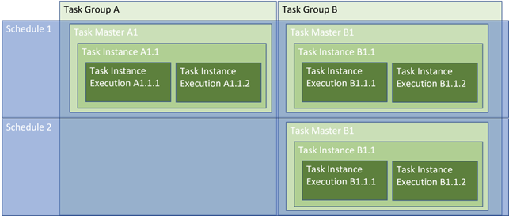

# Web Application Manual

## Lockbox WebApp Role and Components

The WebApp deployed as part of the Lockbox is the main interface used to
create and manage tasks performed by the solution. It allows users to:

-   Create and manage tasks

-   Create and manage schedules

-   Monitor activities

The WebApp orchestrates activities taking place in the solution (Mainly
in Azure Data Factory and Synapse). To do so, the following concepts are
used:

1.  Task Masters: These define a specific task. As part of a task
    master, users can define a task type, a source and a destination in
    which the task will interact with. This can range from a data copy
    type activity to executing a synapse notebook. The user can also
    assign the task to a specific schedule

2.  Task Instances: These are every instance a task master has been used
    to execute that specific task. A new instance will be created each
    time a schedule triggers a specific task master.

    -   Task Instance Execution: Each time a task instance executes, a
        new Task Instance Execution will be created. There should be
        normally be only one execution per task instance but in some
        cases there will be more. This is usually in the case of an
        error or time out; the user is then able to look at the logs of
        each execution to diagnose the reason for multiple execution
        attempts.

3.  Task Groups: Tasks can be assigned to different task groups. This
    allows for easier management of tasks when wanting to generalise
    certain aspects of tasks.

4.  Schedules: Schedules are defined as time triggers that will kick-off
    activities that have been assigned to those triggers. The solution
    comes with default schedules to be used as examples but users can
    add/modify as required.

    -   Schedule Instance: Each time a Schedule is executed, a new
        Schedule instance will be created. The Schedule Instance will
        contain all of the Task Instances associated with it that have
        been created due to the Schedule being executed.

5.  Logs: Logs are created for every action the function app takes. Any
    errors or warnings will be listed in the Logs under their
    corresponding Function / Task Instance Execution.

Below is a representation of how these concepts interact with each
other.

