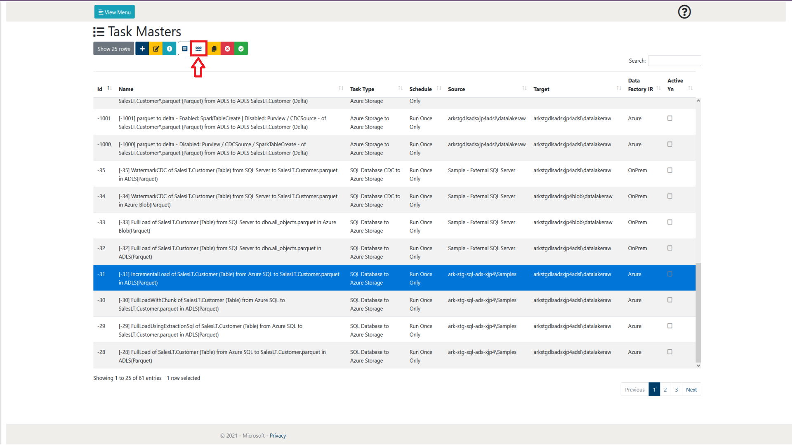

# 1. Task Masters

The following section will go into detail on how to create, manage and
delete tasks from a user perspective. It will also explain the other
features that are available on the Task Master page.

The Task Master page can be accessed in two ways. As shown in figure
1-1, it is accessible through the View Details link on the main page.
The other way is to access it through the View Menu button shown in
figure 1-2 and 1-3.

  
 Figure 1-1: Lockbox WebApp Main Page - Task Masters View Details selection   
  
Figure 1-2: LockBox WebApp Main Menu - Tasks selection  
  
Figure 1-3: LockBox Menu Task Masters selection  

## 1.1        Page overview

When browsing the Task Masters page, a layout similar to figure 1.1-1
will be shown to you. Following the figure some more details will be
provided on what each of these items represent.

 
Figure 1.1-1: Task Masters page overview 

<table>
<colgroup>
<col style="width: 10%" />
<col style="width: 14%" />
<col style="width: 74%" />
</colgroup>
<thead>
<th><strong>Number</strong></th>
<th><strong>Object Name</strong></th>
<th><strong>Description</strong></th>
</thead>
<tbody>
<tr class="odd">
<td>1</td>
<td>Show rows selection</td>
<td>This allows the user to define how many rows of Task Masters they
wish to view per page. At the time of writing, the selections available
are 10, 25, 50 and 100. As can be seen in figure 1.1-1 at the bottom
right of the page there is also a page selection to be able to browse
through pages of created Task Masters</td>
</tr>
<tr class="even">
<td>2</td>
<td>Add Item</td>
<td>
This allows the user to create a new Task Master. Further details
of the creation process can be found in section 1.2 Creating a Task
Master and section 1.3 Task Types.

 
</td>
</tr>
<tr class="odd">
<td>3</td>
<td>Edit Item</td>
<td>This allows the user to modify an already existing Task Master. This
will allow them to go back through the wizard and modify any details
they wish to amend to the Task Master. Further details can be found in
section 1.5 Modifying a Task Master.</td>
</tr>
<tr class="even">
<td>4</td>
<td>View Details</td>
<td>
This allows the user to view the details of an already existing
and selected Task Master. Once interacted with, this displays a single
page overview of the selected Task Master without having to go through
the wizard to see each individual section. There is then the further
option to edit the Task Master and further details of this process can
be found in section 1.5 Modifying a Task Master.

 
</td>
</tr>
<tr class="odd">
<td>5</td>
<td>View Task Instances</td>
<td>
This allows the user to view the Task Instances of the currently
selected Task Master. Further details can be found in section 2 Task
Instances.

 
</td>
</tr>
<tr class="even">
<td>6</td>
<td>View Water Mark</td>
<td>This allows the user to view the Water Mark(s) of the currently
selected Task Master. Further details can be found in section 1.4 Task
Master Water Mark.</td>
</tr>
<tr class="odd">
<td>7</td>
<td>Copy Tasks</td>
<td>
This allows the user to create a copy of the currently selected
Task Master. Further details can be found in section 1.7 Copying a Task
Master.

 
</td>
</tr>
<tr class="even">
<td>8</td>
<td>Deactivate Tasks</td>
<td>This allows the user to deactivate the selected Task Master(s).
Further details can be found in section 1.8 Activating / Deactivating a
Task Master.</td>
</tr>
<tr class="odd">
<td>9</td>
<td>Activate Tasks</td>
<td>This allows the user to activate the selected Task Master(s).
Further details can be found in section 1.8 Activating / Deactivating a
Task Master.</td>
</tr>
<tr class="even">
<td>10</td>
<td>Help</td>
<td>This allows the user to display some help text that gives a summary
of the current web page.</td>
</tr>
<tr class="odd">
<td>11</td>
<td>Search</td>
<td>This allows the user to search for a Task Master by name. The Task
Masters displayed will only be related to the search term input by the
user.</td>
</tr>
<tr class="even">
<td>12</td>
<td>Task Master</td>
<td>This is an example of a created Task Master. A Task Master will
create Task Instances of itself which can be viewed in the Task
Instances page or by selecting the View Task Instances button (5). The
Task Master in this format contains an overview of the main parts of the
itself. Further information can be obtained by selecting the task and
either editing (3) or viewing its details (4).</td>
</tr>
</tbody>
</table>

## 1.2        Creating a Task Master

This section will provide the user with an overview of the Task Master
creation process. It will step through each part of the creation wizard
and go into some detail on each part. Further details on certain
properties may be provided in other sections of this document (and will
be referenced at the appropriate location).

Following this will be a step by step process of how a Task Master is
created. The example will be done using a Azure Storage to Azure Storage
Task Type. More details about Task types can be found in section 1.3
Task Types.

### 1.2.1   Step 0 – Add Item

To initiate the creation process, we need add a new Task Master, this is
done by selecting the ‘Add Item’ button. This will then begin the Task
Master creation wizard process. This is shown in figure 1.2.1-1.

 
Figure 1.2.1-1: Task Masters Add Item overview 

### 1.2.2   Step 1 – Task Name, Basic Settings and Type

The following table references figure 1.2.2-1.

<table>
<colgroup>
<col style="width: 10%" />
<col style="width: 12%" />
<col style="width: 12%" />
<col style="width: 63%" />
</colgroup>
<thead>
<tr class="header">
<th><strong>Number</strong></th>
<th><strong>Object Name</strong></th>
<th><strong>Input Type</strong></th>
<th><strong>Description</strong></th>
</tr>
</thead>
<tbody>
<tr class="odd">
<td>1</td>
<td>Task Master Name</td>
<td>Text</td>
<td>This allows the user to enter a name for the Task Master. This
currently has a 200 character limit. This is purely for the user’s
identification purposes.</td>
</tr>
<tr class="even">
<td>2</td>
<td>Task Group Id</td>
<td>Dropdown</td>
<td>This allows the user to assign the Task Master to a Task Group. This
can be used for further functionality and more details can be found
within section 3</td>
</tr>
<tr class="odd">
<td>3</td>
<td>Schedule Master Id</td>
<td>Dropdown</td>
<td>
This allows the user to assign the Task Master to a schedule. By
default the choices are:

<ul>
<li>
At 0:00 on day-of-month 1 in every 3rd month.
</li>
<li>
Every hour
</li>
<li>
Every minute
</li>
<li>
Every second
</li>
<li>
Run Once only
</li>
</ul>

More schedules can be created by the user in the Schedule Masters
page and more details can be found within section 4
</td>
</tr>
<tr class="even">
<td>4</td>
<td>IsActive</td>
<td>Checkbox</td>
<td>This allows the user to decide whether the Task Master will be
initially active when it is created. An inactive Task Master will not
create Task Instances of itself, meaning that it will not execute its
activity.</td>
</tr>
<tr class="odd">
<td>5</td>
<td>Task Type Id</td>
<td>Dropdown</td>
<td>This allows the user to assign a Task Type to the Task Master. This
will define the detail of the following steps of the creation process.
The Task Type will categorise the type of activity you wish to execute.
Further details about Task Types can be found in section 1.3.</td>
</tr>
</tbody>
</table>

[1.2.2-1](../assets/img/4/TaskMasters/TaskMasterWizardStep1-1_2_2-1.png) 
Figure 1.2.2-1: Task Masters creation wizard step 1 

### 1.2.3   Step 2 – Source System

The following table references figure 1.2.3-1.

| **Number** | **Object Name**  | **Input Type** | **Description**                                                                                                                                                                                                                                       |
|------------|------------------|----------------|-------------------------------------------------------------------------------------------------------------------------------------------------------------------------------------------------------------------------------------------------------|
| 1          | Source System Id | Dropdown       | This allows the user to select the source system to be used for the task being created. Depending on the Task Type, different source systems will be available to select. Source Systems are loaded from the MetadataDB table SourceAndTargetSystems. |

 
Figure 1.2.3-1: Task Masters creation wizard step 2 

### 1.2.4   Step 3 – Target System

The following table references figure 1.2.4-1.

| **Number** | **Object Name**  | **Input Type** | **Description**                                                                                                                                                                                                                                       |
|------------|------------------|----------------|-------------------------------------------------------------------------------------------------------------------------------------------------------------------------------------------------------------------------------------------------------|
| 1          | Target System Id | Dropdown       | This allows the user to select the target system to be used for the task being created. Depending on the Task Type, different target systems will be available to select. Target Systems are loaded from the MetadataDB table SourceAndTargetSystems. |

 
Figure 1.2.4-1: Task Masters creation wizard step 3 

### 1.2.5   Step 4 – Task Type Specific Settings

The following table references figure 1.2.5-1.

| **Number** | **Object Name** | **Input Type** | **Description**                                                                                                                                                                                                                                                                                                                                                                                                                                                                                                                                                                                                                                                                              |
|------------|-----------------|----------------|----------------------------------------------------------------------------------------------------------------------------------------------------------------------------------------------------------------------------------------------------------------------------------------------------------------------------------------------------------------------------------------------------------------------------------------------------------------------------------------------------------------------------------------------------------------------------------------------------------------------------------------------------------------------------------------------|
| 1          | Source Sub-Type | Dropdown       | This allows for the user to select a source sub-type (in this example image, file type) which will then prefill the TaskMasterJson with the inputs required to create the expected Task Master for the Task Type selected. Some of the inputs provided may be optional, which can be seen by hovering over the additional information. The sub-types will relate directly to the Task Type selected by the user and more details on Task Types can be found in section 1.3 Task Types.                                                                                                                                                                                                       |
| 2          | Target Sub-Type | Dropdown       | This allows for the user to select a target sub-type (in this case, file type) which will then prefill the TaskMasterJson with the inputs required to create the expected Task Master for the Task Type selected. Some of the inputs provided may be optional, which can be seen by hovering over the additional information. The sub-types will relate directly to the Task Type selected by the user and more details on Task Types can be found in section 1.3 Task Types.                                                                                                                                                                                                                |
| 3          | TaskMasterJson  | Multiple       | This contains all of the data that will be compiled into the Task Master JSON file created with the Task Master. This JSON is integral to the activities run by the function app. This can be modified by either using the inputs prompted to the user (depending on Task Type and sub-type) to the user or by selecting the JSON button next to the TaskMasterJson title text to modify the JSON file directly as shown in figure 1.2.5-2. The properties button will allow the user to modify and add new properties as shown in figure 1.2.5-3. This may be useful for an activity such as a Custom Synapse Notebook execution if you wish for an additional parameter to be passed over. |
| 4          | Source          | Multiple       | This contains all of the data that will be compiled under the Source property within the Task Master JSON file. The data required for this property will differ depending on the Task Type. This can be modified by either using the inputs prompted (depending on Task Type) to the user or by selecting the JSON button next to the Source title text to modify the JSON file directly. The properties button will allow the user to modify and add new properties to the Source property within the Task Master JSON.                                                                                                                                                                     |
| 5          | Target          | Multiple       | This contains all of the data that will be compiled under the Target property within the Task Master JSON file. The data required for this property will differ depending on the Task Type. This can be modified by either using the inputs prompted (depending on Task Type) to the user or by selecting the JSON button next to the Source title text to modify the JSON file directly. The properties button will allow the user to modify and add new properties to the Target property within the Task Master JSON.                                                                                                                                                                     |

 
Figure 1.2.5-1: Task Masters creation wizard step 4 

 
Figure 1.2.5-2: TaskMasterJson JSON button detail  

 
Figure 1.2.5-3: TaskMasterJson properties button detail  

### 1.2.6   Step 5 – Performance, Dependencies and Advanced Settings

The following table references figure 1.2.6-1.

| **Number** | **Object Name**                 | **Input Type** | **Description**                                                                                                                                                                                                                                                                                                                                                                                                                                                                               |
|------------|---------------------------------|----------------|-----------------------------------------------------------------------------------------------------------------------------------------------------------------------------------------------------------------------------------------------------------------------------------------------------------------------------------------------------------------------------------------------------------------------------------------------------------------------------------------------|
| 1          | Degree of Copy Parallelism      | Integer        | TBD                                                                                                                                                                                                                                                                                                                                                                                                                                                                                           |
| 2          | Allow Multiple Active Instances | Checkbox       | This allows the user to specify whether the TaskMaster will allow itself to have multiple active instances at the same time. Further details on Task Instances can be found in section 2 Task Instance.                                                                                                                                                                                                                                                                                       |
| 3          | Task Datafactory Ir             | Dropdown       | This allows the user to select a specific Integration Runtime to be used to execute the task when it is active. The user will only be able to select a integrated runtime that are usable with both the source AND target. Further details on these mappings can be found within the IntegratedRuntimeMapping table within the MetadataDb. If you create a custom source or target, ensure that the IntegratedRunTimeMapping table has been updated with your new applicable mapping entries. |
| 4          | Dependency Chain Tag            | Text           | TBD                                                                                                                                                                                                                                                                                                                                                                                                                                                                                           |
| 5          | Engine Id                       | Dropdown       | This allows the user to select a specific Execution Engine to be used for the task when it is active. For example, if the user has multiple datafactory instances registered, it will allow them to select the specific instance they wish to use. By default, there is a datafactory and synapse workspace available as an engine. Ensure that you do not select a Synapse Execution Engine for an ADF pipeline as that will throw an error (and vice versa).                                |

 
Figure 1.2.6-1: Task Masters creation wizard step 5  

## 1.3        Task Types

The following section will go into further detail about each of the Task
Types available at the time of the creation of this document. Task Types
are used to define what the specific goal of the Task Master being
created is. Depending on its purpose, different parameters need to be
created and assigned by the user. The steps affected by the chosen Task
Type include:

-   Step 2 – Depending on the Task Type, different source systems will
    be available to be selected.

-   Step 3 – Depending on the Task Type, different target systems will
    be available to be selected.

-   Step 4 – Depending on the Task Type, Source system and Target system
    chosen, different Source and Target Sub-types will be available to
    be selected.

A Glossary table for the terms of the following sections can be found in the Task Types Glossary Table section.

### 1.3.1   Azure Storage to Azure Storage

This Task Type allows for file transfers to be done from storage device
to storage device. It is also possible to make modifications such as
changing the file type.

#### 1.3.1.1  Source and Target Systems

The user will be able to select a list of available storage containers.
This can range from a blob storage within the deployed resource group or
a registered on premises file server.

#### 1.3.1.2  Source and Target Sub-types

<table>
<colgroup>
<col style="width: 12%" />
<col style="width: 25%" />
<col style="width: 61%" />
</colgroup>
<thead>
<tr class="header">
<th><strong>Source Sub-type</strong></th>
<th><strong>Target Sub-type</strong></th>
<th><strong>Task Master Sub-type Inputs</strong></th>
</tr>
</thead>
<tbody>
<tr class="odd">
<td>
Excel

<strong>(ADF)</strong>
</td>
<td>CSV/Parquet/Json</td>
<td><ul>
<li>
DataFileName  (r)
</li>
<li>
MaxConcurrentConnections (r)
</li>
<li>
RelativePath (r)
</li>
<li>
SchemaFileName (r)
</li>
<li>
SheetName (r)
</li>
<li>
SkipLineCount (r)
</li>
</ul></td>
</tr>
<tr class="even">
<td>
Parquet

<strong>(ADF)</strong>
</td>
<td>Parquet/Json/Csv/Delta</td>
<td><ul>
<li>
RelativePath (r)
</li>
<li>
DataFileName (r)
</li>
<li>
Recursively
</li>
<li>
DeleteAfterCompletion  
</li>
<li>
TriggerUsingAzureStorageCache
</li>
<li>
MaxConcurrentConnections  (r)
</li>
<li>
SchemaFileName (r)
</li>
</ul></td>
</tr>
<tr class="odd">
<td>
Binary

<strong>(ADF)</strong>
</td>
<td>Binary</td>
<td><ul>
<li>
RelativePath (r)
</li>
<li>
DataFileName (r)
</li>
<li>
Recursively (r)
</li>
<li>
DeleteAfterCompletion (r)
</li>
<li>
MaxConcurrentConnections (r)
</li>
<li>
SchemaFileName
</li>
</ul></td>
</tr>
<tr class="even">
<td>
Csv

<strong>(ADF)</strong>
</td>
<td>Parquet/Json</td>
<td><ul>
<li>
DataFileName (r)
</li>
<li>
FirstRowAsHeader (r)
</li>
<li>
MaxConcurrentConnections (r)
</li>
<li>
RelativePath (r)
</li>
<li>
SchemaFileName (r)
</li>
<li>
SkipLineCount (r)
</li>
</ul></td>
</tr>
<tr class="odd">
<td>
Json

<strong>(ADF)</strong>
</td>
<td>Parquet/Json</td>
<td><ul>
<li>
DataFileName (r)
</li>
<li>
MaxConcurrentConnections (r)
</li>
<li>
RelativePath (r)
</li>
<li>
SchemaFileName (r)
</li>
</ul></td>
</tr>
<tr class="even">
<td rowspan="2">
Delta

<strong>(SYN)</strong>
</td>
<td rowspan="2">Delta/Parquet</td>
<td><ul>
<li>
DataFileName (r)
</li>
<li>
MaxConcurrentConnections (r)
</li>
<li>
RelativePath (r)
</li>
<li>
SchemaFileName (r)
</li>
<li>
WriteSchemaToPurview (r)
</li>
</ul></td>
</tr>
<tr class="odd">
<td>
Below are the properties that are always present when a Delta
sub-type (Source or Target) is selected:

<ul>
<li>
CDCSource  (r)
</li>
<li>
Purview (r)
</li>
<li>
QualifiedIDAssociation
</li>
<li>
SparkTableCreate (r)
</li>
<li>
SparkTableDBName
</li>
<li>
SparkTableName
</li>
</ul></td>
</tr>
</tbody>
</table>

\(r\) = required input to create Task Master.

(ADF) = This sub-type uses Azure Data Factory as its execution engine

(SYN) = This sub-type uses Synapse as its execution engine.

### 1.3.2   Azure Storage to SQL Database

This Task Type allows for file transfers to be done from storage device
to a SQL database. The main modifications by the user will be dependent
on any custom modifications they wish to make to the data when inputting
it into the database.

#### 1.3.2.1   Source and Target Systems

The user will be able to select a list of available storage containers
as the Source and select any available SQL servers as the Target.

#### 1.3.2.1   Source and Target Sub-types

<table>
<colgroup>
<col style="width: 25%" />
<col style="width: 15%" />
<col style="width: 59%" />
</colgroup>
<thead>
<tr class="header">
<th><strong>Sub-type Name</strong></th>
<th><strong>Sub-type</strong></th>
<th><strong>Task Master Sub-type Inputs</strong></th>
</tr>
</thead>
<tbody>
<tr class="odd">
<td>
Excel

<strong>(ADF)</strong>
</td>
<td>Source</td>
<td><ul>
<li>
DataFileName (r)
</li>
<li>
FirstRowAsHeader (r)
</li>
<li>
MaxConcurrentConnections (r)
</li>
<li>
RelativePath (r)
</li>
<li>
SchemaFileName (r)
</li>
<li>
SheetName (r)
</li>
<li>
SkipLineCount (r)
</li>
</ul></td>
</tr>
<tr class="even">
<td>
Csv

<strong>(ADF)</strong>
</td>
<td>Source</td>
<td><ul>
<li>
DataFileName (r)
</li>
<li>
FirstRowAsHeader (r)
</li>
<li>
MaxConcurrentConnections (r)
</li>
<li>
RelativePath (r)
</li>
<li>
SchemaFileName (r)
</li>
<li>
SkipLineCount (r)
</li>
</ul></td>
</tr>
<tr class="odd">
<td>
Json

<strong>(ADF)</strong>
</td>
<td>Source</td>
<td><ul>
<li>
DataFileName (r)
</li>
<li>
MaxConcurrentConnections (r)
</li>
<li>
RelativePath (r)
</li>
<li>
SchemaFileName (r)
</li>
</ul></td>
</tr>
<tr class="even">
<td>
Parquet

<strong>(ADF)</strong>
</td>
<td>Source</td>
<td><ul>
<li>
RelativePath (r)
</li>
<li>
DataFileName (r)
</li>
<li>
Recursively
</li>
<li>
DeleteAfterCompletion
</li>
<li>
TriggerUsingAzureStorageCache
</li>
<li>
MaxConcurrentConnections
</li>
<li>
SchemaFileName (r)
</li>
</ul></td>
</tr>
<tr class="odd">
<td>
Table

<strong>(ADF)</strong>
</td>
<td>Target</td>
<td><ul>
<li>
AutoCreateTable (r)
</li>
<li>
AutoGenerateMerge (r)
</li>
<li>
MergeSQL (r)
</li>
<li>
PostCopySQL (r)
</li>
<li>
PreCopySQL (r)
</li>
<li>
StagingTableName (r)
</li>
<li>
StagingTableSchema (r)
</li>
<li>
TableName (r)
</li>
<li>
TableSchema (r)
</li>
</ul></td>
</tr>
</tbody>
</table>

\(r\) = required input to create Task Master.

(ADF) = This sub-type uses Azure Data Factory as its execution engine

(SYN) = This sub-type uses Synapse as its execution engine.

### 1.3.3   SQL Database to Azure Storage

This Task Type allows for file transfers to be done from a SQL database
to a storage device. The main modifications by the user will be
dependent on any the SQL statement they wish to make when extracting the
data from the database.

If you wish to use a watermark with this Task Type, ensure that the
watermark has been created and is active for the Task before it is
executed otherwise it will not in the manner you hope or at all
depending on the task set up. For more information on creating a
watermark, refer to section 1.4.

#### 1.3.3.1  Source and Target Systems

The user will be able to select a list of available SQL databases as the
Source and select any available storage containers as the Target.

#### 1.3.3.2  Source and Sub-types

<table>
<colgroup>
<col style="width: 29%" />
<col style="width: 17%" />
<col style="width: 52%" />
</colgroup>
<thead>
<tr class="header">
<th><strong>Sub-type Name</strong></th>
<th><strong>Sub-type</strong></th>
<th><strong>Task Master Sub-type Inputs</strong></th>
</tr>
</thead>
<tbody>
<tr class="odd">
<td>
Table / SQL

<strong>(ADF)</strong>
</td>
<td>Source</td>
<td><ul>
<li>
IncrementalType (r)
</li>
<li>
TableSchema
</li>
<li>
TableName
</li>
<li>
ChunkField
</li>
<li>
ChunkSize
</li>
<li>
ExtractionSQL
</li>
</ul></td>
</tr>
<tr class="even">
<td>
Parquet

<strong>(ADF)</strong>
</td>
<td>Target</td>
<td><ul>
<li>
RelativePath (r)
</li>
<li>
DataFileName (r)
</li>
<li>
SchemaFileName (r)
</li>
</ul></td>
</tr>
</tbody>
</table>

\(r\) = required input to create Task Master.

(ADF) = This sub-type uses Azure Data Factory as its execution engine

(SYN) = This sub-type uses Synapse as its execution engine.

### 1.3.4   SQL Database CDC to Azure Storage

This Task Type allows for file transfers to be done from a SQL database
with CDC enabled tables to a storage device.

The user must ensure that they create and attach a watermark (of the LSN
format) to any task of this type as they will require this for the task
to execute. To create a watermark, please refer to section 1.4. If you
have an existing LSN you may use that as the ‘Watermark String Value’
otherwise leave it blank as the task will generate an LSN after first
task execution (assuming the task has a watermark of the LSN type
created and active).

 

#### 1.3.4.1  Source and Target Systems

The user will be able to select a list of available SQL databases as the
Source and select any available storage containers as the Target.  Be
warned, if the referenced DB is not of the CDC type – this task will not
work and you should use the Task Type of SQL Database to Azure Storage
instead.

#### 1.3.4.2  Source and Target Sub-types

<table>
<colgroup>
<col style="width: 29%" />
<col style="width: 17%" />
<col style="width: 52%" />
</colgroup>
<thead>
<tr class="header">
<th><strong>Sub-type Name</strong></th>
<th><strong>Sub-type</strong></th>
<th><strong>Task Master Sub-type Inputs</strong></th>
</tr>
</thead>
<tbody>
<tr class="odd">
<td>
Table

<strong>(ADF)</strong>
</td>
<td>Source</td>
<td><ul>
<li>
TableSchema
</li>
<li>
TableName
</li>
</ul></td>
</tr>
<tr class="even">
<td>
Parquet

<strong>(ADF)</strong>
</td>
<td>Target</td>
<td><ul>
<li>
RelativePath (r)
</li>
<li>
DataFileName (r)
</li>
<li>
SchemaFileName (r)
</li>
</ul></td>
</tr>
</tbody>
</table>

\(r\) = required input to create Task Master.

(ADF) = This sub-type uses Azure Data Factory as its execution engine

(SYN) = This sub-type uses Synapse as its execution engine.

### 1.3.5   Execute ADF Pipeline

This Task has yet to be implemented and this section is a placeholder.
Currently selecting this task will result in an error on the web
application.

### 1.3.6   Execute SQL Statement

This Task Type allows the user to execute a SQL statement on one or two
databases. Whilst it is required to have two sub types, the user may
decide to leave one of them blank (the source or target) if they do not
require the statement to be run against multiple databases.

Ensure that the last SQL statement returns at least one row or this task
will throw an error.

#### 1.3.6.1  Source and Target Systems

The user will be able to select a list of available SQL databases as the
source and target systems. Whilst it is required to pick both a source
and target, as stated above, you are not required to fill in the
sub-type information for both. As long as the statement has at least one
row returning, it will work properly.

#### 1.3.6.2  Source and Target Sub-types

<table>
<colgroup>
<col style="width: 100%" />
</colgroup>
<thead>
<tr class="header">
<th><strong>Task Master Inputs (always present)</strong></th>
</tr>
</thead>
<tbody>
<tr class="odd">
<td><ul>
<li>
SQLStatement (r)
</li>
<li>
TableName (r)
</li>
</ul></td>
</tr>
</tbody>
</table>

<table>
<colgroup>
<col style="width: 26%" />
<col style="width: 25%" />
<col style="width: 48%" />
</colgroup>
<thead>
<tr class="header">
<th><strong>Sub-type Name</strong></th>
<th><strong>Sub-type</strong></th>
<th><strong>Task Master Sub-type Inputs</strong></th>
</tr>
</thead>
<tbody>
<tr class="odd">
<td>
NA

<strong>(ADF)</strong>
</td>
<td>Source / Target</td>
<td><ul>
<li>
TableSchema
</li>
<li>
TableName
</li>
</ul></td>
</tr>
</tbody>
</table>

\(r\) = required input to create Task Master.

(ADF) = This sub-type uses Azure Data Factory as its execution engine

(SYN) = This sub-type uses Synapse as its execution engine.

### 1.3.7   REST API To Azure Storage

This Task Type allows the user to make a request to a specified REST API
and store the result in a storage device. The modifications for this
Task Type will be dependent on the user modifying the
SourceAndTargetSystem table within the Metadata DB.

**How to set up a REST API Source**

To set up a REST API source type:

Create the REST API source within the SourceAndTargetSystems table using
an insert SQL statement. This is a standard Source that corresponds the
following properties

-   SystemId – The primary key (unique ID) of the row, ensure that it is
    unique.

-   SystemName – The name of the System, this will show in the web app
    when selecting it as a source. Up to the user.

-   SystemType – This MUST be ‘Rest’ as this allows the Lockbox to
    associate this Rest type with the TaskType when selected in the web
    app.

-   SystemDescription – User description, only used in the database for
    personal reference.

-   SystemAuthType – ‘MSI’

-   SystemUserName – ‘’ – Can leave blank

-   SystemSecretName- ‘’ – Can leave blank

-   SystemKeyVaultBaseUrl – The base URL of your keyvault.

-   SystemJSON – The SystemJSON follows a schema which can be found in
    the SourceAndTargetSystems_JsonSchema table. Several examples have
    been provided with the Sample REST Sources within the
    SourceAndTargetSystems table. A breakdown of the JSON properties:

    -   BaseUrl: Required, this is a string containing the
        **<u>BASE</u>** URL of the API you are looking to target.

    -   headers: Required, this is a *<u>stringified</u>* JSON
        containing the headers you wish to use for the API you are
        targeting. If you do not require any headers (no authentication
        / other properties required) you can just leave this as “{}”. An
        example of a header containing authentication is:
        *"headers" : "{ \\"Authorization\\": \\"Bearer $InsertSecret($KeyVault(ark-stg-kv-ads-xjp4).$SecretName(bearerToken).$LinkedServiceName(SLS_AzureKeyVault))$END\\"}".*
        This header would be used to authenticate the API call with a
        token that is stored within the keyvault being referenced. More
        information about inserting a secret for a REST API call will be
        detailed in the next section. NOTE: All “ must be escaped with a
        \\ (except the first and last) to ensure that the json is
        properly read.

    -   NextPageUrlKey: Optional, this is a string representing the key
        within the response json from a REST API request that holds the
        **<u>FULL</u>** URL for the next rest request to continue
        getting results. This is used for pagination, usually in a GET
        request when you are expecting to receive large amounts of data
        in response to your request. This assumes that the value of this
        key value pair is the complete URL of the next page of the
        request. An example, a JSON contains a key called
        ‘next_page_url' and its corresponding value has the next FULL
        URL for the next request. You would put ‘next_page_url’ as the
        value of ‘NextPageUrlKey’ within your SystemJSON. Subsequently,
        when making the Task within the web application, you would
        select ‘NextPageUrlKey’ for the ‘Pagination’ option. This will
        allow the RestAPINotebook to recursively search the response
        JSON for the key ‘next_page_url’ and will continue to make new
        requests until there are no longer any new pages for the
        original request. NOTE: This is currently experimental and may
        not work for some use cases, it can be modified and then you can
        specify the REST API Task Type to use your customised notebook
        instead of the default one. It will also NOT work for key value
        pairs that store partial URLs at the moment of writing this
        document.

-   ActiveYN – True or False

-   IsExternal – True

-   DataFactoryIR – ‘’ – Can leave blank

**How to use Secrets for a REST API**

To ensure that authentication is not being stored in plain text, a way
to reference API tokens for authentication has been made. There are two
places you can reference a keyvault secret for a REST API Task Type.

-   Within the headers (in the SystemJSON)

> *"headers" : "{ \\"Authorization\\": \\"Bearer $InsertSecret($KeyVault(ark-stg-kv-ads-xjp4).$SecretName(bearerToken).$LinkedServiceName(SLS_AzureKeyVault))$END\\"}"*

-   Within the relative URL (in the source sub task type)

  

*To properly reference a secret, a strict syntax must be followed, this
is:*

$InsertSecret($KeyVault(**KVName**).$SecretName(**SName**).$LinkedServiceName(**LSName**))$END

Everything that has been bolded, must be replaced with your values.

**KVName** – The name of the keyvault that stores the secret you wish to
reference

**SName** – The name of the secret you wish to reference

**LSName** – The name of the linked service to the Keyvault from your
Synapse Workspace Execution Engine that will run the task. By Default,
the linked service deployed in Synapse with the lockbox will be named
‘SLS_AzureKeyVault’.

#### 1.3.7.1  Source and Target Systems

The user will be able to select a list of available REST API’s as the
source and select any available storage devices as the target system.

#### 1.3.7.2  Source and Target Sub-types

<table>
<colgroup>
<col style="width: 100%" />
</colgroup>
<thead>
<tr class="header">
<th><strong>Task Master Inputs (always present)</strong></th>
</tr>
</thead>
<tbody>
<tr class="odd">
<td><ul>
<li>
ExecuteNotebook (r)
</li>
<li>
Purview (r)
</li>
<li>
QualifiedIDAssociation
</li>
<li>
UseNotebookActivity (r)
</li>
</ul></td>
</tr>
</tbody>
</table>

<table>
<colgroup>
<col style="width: 29%" />
<col style="width: 17%" />
<col style="width: 52%" />
</colgroup>
<thead>
<tr class="header">
<th><strong>Sub-type Name</strong></th>
<th><strong>Sub-type</strong></th>
<th><strong>Task Master Sub-type Inputs</strong></th>
</tr>
</thead>
<tbody>
<tr class="odd">
<td>
Rest

<strong>(SYN)</strong>
</td>
<td>Source</td>
<td><ul>
<li>
RelativeUrl (r)
</li>
<li>
RequestBody
</li>
<li>
RequestMethod (r)
</li>
<li>
Pagination (r)
</li>
</ul></td>
</tr>
<tr class="even">
<td>
Json

<strong>(SYN)</strong>
</td>
<td>Target</td>
<td><ul>
<li>
DataFileName (r)
</li>
<li>
RelativePath (r)
</li>
</ul></td>
</tr>
</tbody>
</table>

\(r\) = required input to create Task Master.

(ADF) = This sub-type uses Azure Data Factory as its execution engine

(SYN) = This sub-type uses Synapse as its execution engine.

### 1.3.8   Execute Synapse Notebook

This task type allows for the user to execute a Synapse notebook of
their choosing. There are no limitation on the source or target type and
are able to select all relevant sub types to the source and target type
of their choosing. The reason for the lack of limitation is to allow the
user to pass along parameters to the notebook being executed. The
notebook being executed will be passed the TaskMaster JSON as a
parameter and are able to reference it as wanted.

#### 1.3.8.1  Source and Target Systems

As defined above, this task type has no limitation on the source and
target to select. In addition to this, they are able to select ‘N/A’ as
a source and target, if they do not wish to use a source or target.

#### 1.3.8.2  Source and Target Sub-types

<table>
<colgroup>
<col style="width: 100%" />
</colgroup>
<thead>
<tr class="header">
<th><strong>Task Master Inputs (always present)</strong></th>
</tr>
</thead>
<tbody>
<tr class="odd">
<td><ul>
<li>
CustomDefinitions
</li>
<li>
ExecuteNotebook (r)
</li>
<li>
Purview (r)
</li>
<li>
QualifiedIdAssociation
</li>
<li>
UseNotebookActivity (r)
</li>
</ul></td>
</tr>
</tbody>
</table>

<table>
<colgroup>
<col style="width: 29%" />
<col style="width: 23%" />
<col style="width: 47%" />
</colgroup>
<thead>
<tr class="header">
<th><strong>Sub-type Name</strong></th>
<th><strong>Sub-type</strong></th>
<th><strong>Task Master Sub-type Inputs</strong></th>
</tr>
</thead>
<tbody>
<tr class="odd">
<td>
Notebook-Optional

<strong>(SYN)</strong>
</td>
<td>Source / Target</td>
<td><ul>
<li>
DataFileName
</li>
<li>
RelativePath
</li>
<li>
SchemaFileName
</li>
<li>
WriteSchemaToPurview
</li>
</ul></td>
</tr>
</tbody>
</table>

\(r\) = required input to create Task Master.

(ADF) = This sub-type uses Azure Data Factory as its execution engine

(SYN) = This sub-type uses Synapse as its execution engine.

**Note:** It is advised if you wish to add any fields to directly edit
the TaskMasterJson.

### 1.3.9   Start/Pause Dedicated Synapse SQL Pool

This Task Type allows for a user to start or pause a Synapse Dedicated
SQL Pool as a task. This task is designed to enable the ability to start
or stop a SQL Pool without having to directly access the Synapse
Workspace.

#### 1.3.9.1  Source and Target Systems

There is no source system for this task type, it will be displayed as
N/A. The targets allowed will be any Synapse Workspace that is
available.

#### 1.3.9.2  Source and Target Sub-types

The sub-types available for this task type is only “Not-Applicable”.
This is because the only parameters required for this action is the name
of the pool you wish to reference and the action you want to take
against it.

<table>
<colgroup>
<col style="width: 100%" />
</colgroup>
<thead>
<tr class="header">
<th><strong>Task Master Inputs (always present)</strong></th>
</tr>
</thead>
<tbody>
<tr class="odd">
<td><ul>
<li>
SQLPoolName (r)
</li>
<li>
SQLPoolOperation (r)
</li>
</ul></td>
</tr>
</tbody>
</table>

\(r\) = required input to create Task Master.

(ADF) = This sub-type uses Azure Data Factory as its execution engine

(SYN) = This sub-type uses Synapse as its execution engine.

## 1.4        Task Master Water Mark

The Task Master Water Mark page can be accessed in a two different ways.

-   It can be accessed from the menu as shown in figure 1.4-1. This will
    load up an overview of all current Task Master water marks.

-   The other way is from the Task Master page. The user will select a
    Task Master they wish to view the current water marks of and then
    select the View Water Mark button as shown in figure 1.4-2. This
    will load up the current water marks for that specific Task Master
    object.

 
Figure 1.4-1: Task Master Water Mark menu access  

 
Figure 1.4-2: Task Master Water Mark View Watermark access  

### 1.4.1   Page overview

When browsing the Task Master Water Marks page, a layout similar to
figure 1.1-1 will be shown to you. Following the figure some more
details will be provided on what each of these items represent.

 
Figure 1.4.1-1: Task Master Water Marks page overview  

| **Number** | **Object Name**        | **Description**                                                                                                                                                                                                                                                                                                            |
|------------|------------------------|----------------------------------------------------------------------------------------------------------------------------------------------------------------------------------------------------------------------------------------------------------------------------------------------------------------------------|
| 1          | Show rows selection    | This allows the user to define how many rows of Task Masters they wish to view per page. At the time of writing, the selections available are 10, 25, 50 and 100. As can be seen in figure 1.1-1 at the bottom right of the page there is also a page selection to be able to browse through pages of created Task Masters |
| 2          | Add Item               | This allows the user to create a new Task Master Water Mark. Further details of the creation process can be found in section 1.4.2 Creating a Water Mark.                                                                                                                                                                  |
| 3          | Edit Item              | This allows the user to modify an already existing Task Master Water Mark. This will allow them to go back through their inputs and modify any details they wish to amend to the Water Mark.                                                                                                                               |
| 4          | View Details           | This allows the user to view the details of an already existing and selected Water Mark. Once interacted with, this displays a single page overview of the selected Water Mark. If you wish to edit the Water Mark you can select a button to do so from this page or do so from the Task Master Water Marks page (3).     |
| 5          | Help                   | This allows the user to display some help text that gives a summary of the current web page.                                                                                                                                                                                                                               |
| 6          | Search                 | This allows the user to search for a Task Master Water Mark by Task Master Name. The Water Marks displayed will only be related to the search term input by the user.                                                                                                                                                      |
| 12         | Task Master Water Mark | This is an example of a created Task Master Water Mark. A Task Master Water Mark will have a specific column it references, and define what that column holds. For example, in a CDC column, that would be an LSN.                                                                                                         |

### 1.4.2   Creating a Water Mark

To create a Task Master Water Mark, select the Add Item button on the
Task Master Water Mark page. This can be seen in figure 1.4.2-1.

You will then be prompted to enter some details to create the water
mark. Details on this is provided in figure figure 1.4.2-2 and table
1.4.2-1. Once this is completed, select create and your water mark will
be created and assigned to the Task Master specified.

 
Figure 1.4.2-1: Task Master Water Marks Add Item overview  

 
Figure 1.4.2-2: Task Master Water Marks Create Overview  

<table>
<colgroup>
<col style="width: 10%" />
<col style="width: 17%" />
<col style="width: 13%" />
<col style="width: 58%" />
</colgroup>
<thead>
<tr class="header">
<th><strong>Number</strong></th>
<th><strong>Object Name</strong></th>
<th><strong>Input Type</strong></th>
<th><strong>Description</strong></th>
</tr>
</thead>
<tbody>
<tr class="odd">
<td>1</td>
<td>Name</td>
<td>Text / Dropdown</td>
<td>This allows the user to enter or select the name of the Task Master
it is assigned to.  </td>
</tr>
<tr class="even">
<td>2</td>
<td>Column Name</td>
<td>Text</td>
<td>This allows the user to assign the column name for the water
mark.</td>
</tr>
<tr class="odd">
<td>3</td>
<td>Column Type</td>
<td>Text</td>
<td>
This allows the user to enter the name of the column type to be
used with the water mark. This can be one of the following:

<ul>
<li>
DateTime
</li>
<li>
BigInt
</li>
<li>
lsn
</li>
</ul>

 
</td>
</tr>
<tr class="even">
<td>4</td>
<td>Date Time Value</td>
<td>Date Time</td>
<td>This allows the user to assign a Date Time value to the water mark.
Only used if the Column Type is ‘DateTime’.</td>
</tr>
<tr class="odd">
<td>5</td>
<td>Big Integer Value</td>
<td>Integer</td>
<td>This allows the user to assign a Big Integer value to the water
mark. Only used if the Column Type is ‘BigInt’.</td>
</tr>
<tr class="even">
<td>6</td>
<td>String / LSN Value</td>
<td>Text</td>
<td>This allows the user to assign a string or lsn value to the water
mark. Only used if the Column Type is ‘lsn’. Note: Do not assign a value
for the first run if you want a initial full update.</td>
</tr>
<tr class="odd">
<td>7</td>
<td>Configuration Json</td>
<td>JSON</td>
<td>This is a configuration file alongside the watermark. If not
required, just enter ‘{}’.</td>
</tr>
<tr class="even">
<td>8</td>
<td>Is Active</td>
<td>Checkbox</td>
<td>This allows the user to decide whether the Task Master Water Mark
will be initially active when it is created. An inactive water mark will
be ignored when the Task Master has an Instance of itself being
executed.</td>
</tr>
</tbody>
</table>

## 1.5        Modifying a Task Master

To modify an already existing Task Master, select the Task Master you
wish to edit from the Task Master page and then select the ‘Edit Item’
button as shown in figure 1.5-1. This will then prompt the user with the
Task Master creation wizard and will allow them to modify the Task
Master as required. For more information regarding the Task Master
creation wizard refer to section 1.2 Creating a Task Master.

 
Figure 1.5-1: Task Master Edit Item overview  

## 1.6        Deleting a Task Master

Currently the ability to delete a Task Master is disabled. This may be
changed in the future. If you wish to delete a Task Master you can do so
but deleting it from the Metadata DB in the TaskMaster table.

## 1.7        Copying a Task Master

To create a copy of an already existing Task Master(s), select the Task
Master(s) you wish to copy from the Task Master page and then select the
‘Copy Tasks’ button as shown in figure 1.7-1. This will then prompt the
user and a copy of the tasks will be created with ‘Copy’ as a suffix to
their name.

 
Figure 1.7-1: Task Master Copy Tasks overview  

## 1.8        Activating / Deactivating a Task Master

To activate or deactivate an existing Task Master(s), select the Task
Master(s) you wish to activate or deactivate from the Task Master page
and then select the corresponding ‘Deactivate Tasks’ (red, left) or
‘Activate Tasks’ (green, right) button as shown in figure 1.8-1. This
will then prompt the user with a success message and the task will now
be either active or inactive depending on the user choice.

 
Figure 1.8-1: Task Master Activate/Deactivate Tasks overview  
