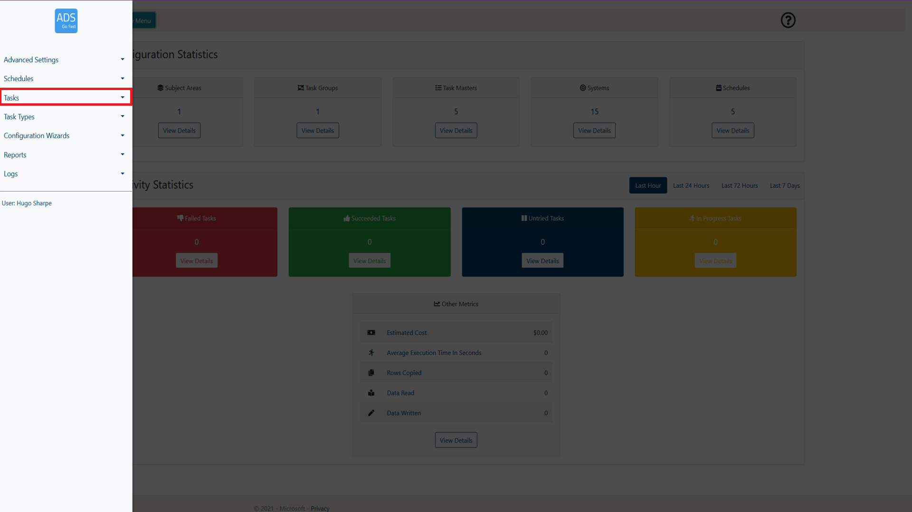
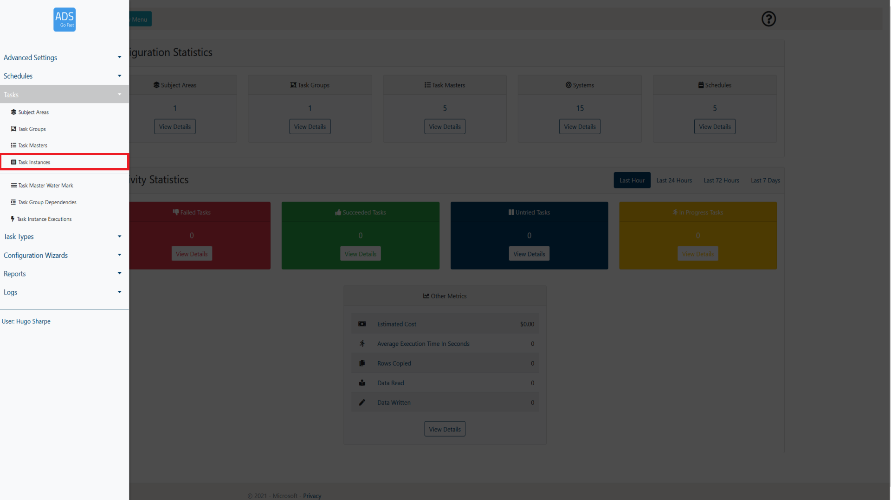
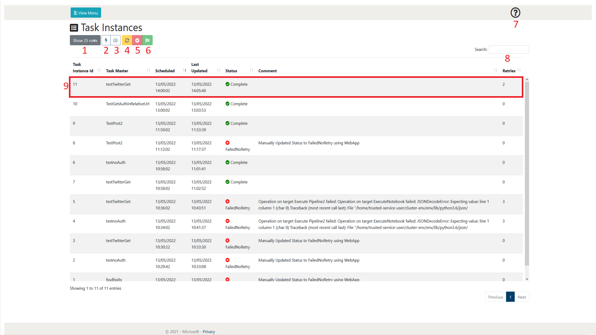
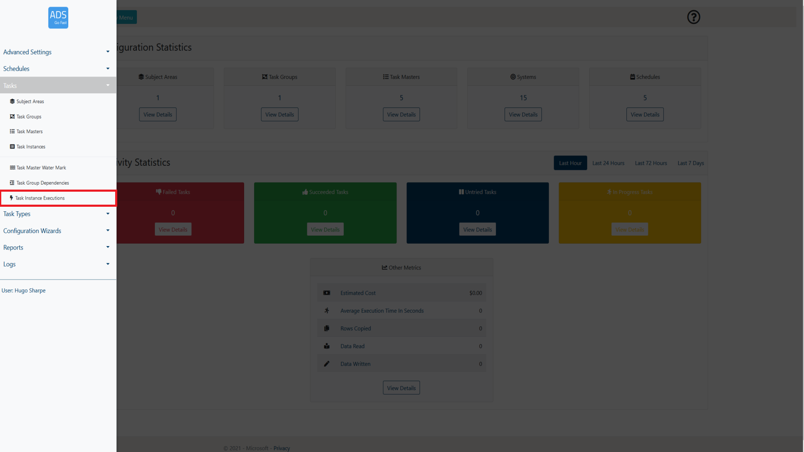
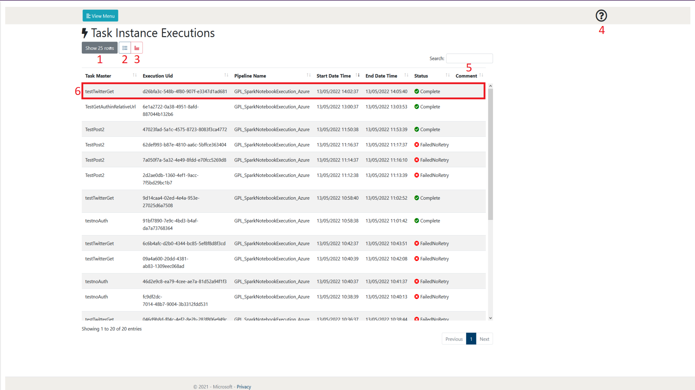

# 2. Task Instances

The following section will go into detail on how to manage and view task
instances from a user perspective. It will also explain the other
features that are available on the Task Instances page.

The Task Instances page can be accessed through the menu. As shown in
figure 2-1 and 2-2, it is accessed through the View Menu button.

 
Figure 2-1: LockBox Menu Tasks selection  

 
Figure 2-2: LockBox Menu Task Instances selection  

## 2.1        Page overview

When browsing the Task Instances page, a layout similar to figure 2.1-1
will be shown to you. Following the figure some more details will be
provided on what each of these items represent.

 
Figure 2.1-1: Task Instances page overview  

<table>
<colgroup>
<col style="width: 10%" />
<col style="width: 19%" />
<col style="width: 69%" />
</colgroup>
<thead>
<th><strong>Number</strong></th>
<th><strong>Object Name</strong></th>
<th><strong>Description</strong></th>
</thead>
<tbody>
<tr class="odd">
<td>1</td>
<td>Show rows selection</td>
<td>This allows the user to define how many rows of Task Masters they
wish to view per page. At the time of writing, the selections available
are 10, 25, 50 and 100. As can be seen in figure 2.1-1 at the bottom
right of the page there is also a page selection to be able to browse
through pages of created Task Masters</td>
</tr>
<tr class="even">
<td>2</td>
<td>View Task Instance Executions</td>
<td>
This allows the user to view the executions of the Task Instance.
Each Task Instance may have multiple executions if the initial or
subsequent execution has failed due to something such as an error. It
may also have multiple executions if the user manually updates the
instance. More information about Task Instance Executions can be found
in section 2.2.

 
</td>
</tr>
<tr class="odd">
<td>3</td>
<td>View Task Master</td>
<td>This allows the user to view the Task Master of the Task Instance
currently selected. More information about Task Masters can be found in
section 1.</td>
</tr>
<tr class="even">
<td>4</td>
<td>Mark as Untried</td>
<td>
This allows the user to update the Task Instance as untried. This
means that the Function app will attempt to create an execution of this
task instance and complete this task as denoted by its relevant Task
Master. It will be noted in the comment of the Task Instance that this
was manually updated by the user.

 
</td>
</tr>
<tr class="odd">
<td>5</td>
<td>Mark as FailedNoRetry</td>
<td>
This allows the user to update the Task as failed with no further
retries being executed. This means that no further Task Instance
Executions will be created for this Task Instance and it will be noted
as a failure to complete its task. It will be noted in the comment of
the Task Instance that this was manually updated by the user.

 
</td>
</tr>
<tr class="even">
<td>6</td>
<td>Mark As Complete</td>
<td>This allows the user mark the Task Instance as complete. This means
that no further executions will be attempted and it is viewed as
successfully completing its task. It will be noted in the comment of the
Task Instance that this was manually updated by the user.</td>
</tr>
<tr class="odd">
<td>7</td>
<td>Help</td>
<td>This allows the user to display some help text that gives a summary
of the current web page.</td>
</tr>
<tr class="even">
<td>8</td>
<td>Search</td>
<td>This allows the user to search for a Task Instance by name. The Task
Instances displayed will only be related to the search term input by the
user.</td>
</tr>
<tr class="odd">
<td>9</td>
<td>Task Instance</td>
<td>This is an example of a created Task Instance. A Task Instance will
create Task Instance Executions of itself which can be viewed in the
Task Instances Execution page or by selecting the View Task Instance
Execution button (2). The Task Instance in this format contains an
overview of the main parts of itself. Further information can be
obtained by selecting the task and either viewing the Task Master (3) or
viewing its executions (2).</td>
</tr>
</tbody>
</table>

Table 2.1-1: Figure 2.1-1 descriptive details

## 2.2        Task Instance Executions

The following section will go into detail on how to manage and view task
instances from a user perspective. It will also explain the other
features that are available on the Task Instance Executions page.

The Task Instances page can be accessed through the menu. As shown in
figure 2.2-1 and 2.2-2, it is accessible through the View Menu button.

 
Figure 2.2-1: LockBox Menu Tasks selection  

 
Figure 2.2-1: LockBox Menu Task Instance Execution selection  

### 2.2.1   Page overview

When browsing the Task Instances page, a layout similar to figure
2.2.1-1 will be shown to you. Following the figure some more details
will be provided on what each of these items represent.

 
Figure 2.2.1-1: Task Instance Executions page overview  

<table>
<colgroup>
<col style="width: 10%" />
<col style="width: 15%" />
<col style="width: 74%" />
</colgroup>
<thead>
<th><strong>Number</strong></th>
<th><strong>Object Name</strong></th>
<th><strong>Description</strong></th>
</thead>
<tbody>
<tr class="odd">
<td>1</td>
<td>Show rows selection</td>
<td>This allows the user to define how many rows of Task Masters they
wish to view per page. At the time of writing, the selections available
are 10, 25, 50 and 100. As can be seen in figure 2.1-1 at the bottom
right of the page there is also a page selection to be able to browse
through pages of created Task Masters</td>
</tr>
<tr class="even">
<td>2</td>
<td>View Task Master</td>
<td>This allows the user to view the Task Master of the Task Instance
Execution currently selected. More information about Task Masters can be
found in section 1.</td>
</tr>
<tr class="odd">
<td>3</td>
<td>View ADF Activity Errors</td>
<td>
This allows the user to view any errors associated with the
currently selected Task Instance Execution. These will assist with any
issues in the form of logs.

 
</td>
</tr>
<tr class="even">
<td>4</td>
<td>Help</td>
<td>This allows the user to display some help text that gives a summary
of the current web page.</td>
</tr>
<tr class="odd">
<td>5</td>
<td>Search</td>
<td>This allows the user to search for a Task Instance by name. The Task
Instances displayed will only be related to the search term input by the
user.</td>
</tr>
<tr class="even">
<td>6</td>
<td>Task Instance Execution</td>
<td>This is an example of a created Task Instance Execution. A Task
Instance Execution allows you to view whether a task has completed
successfully or not including the details of execution. The Task
Instance Execution in this format also contains the pipeline name /
executionUID that can be used to view the task process in detail in the
relevant datafactory or synapse workspace. Further information can be
obtained by selecting the task and either viewing its’ Task Master (2)
or viewing its’ error logs (3).</td>
</tr>
</tbody>
</table>
