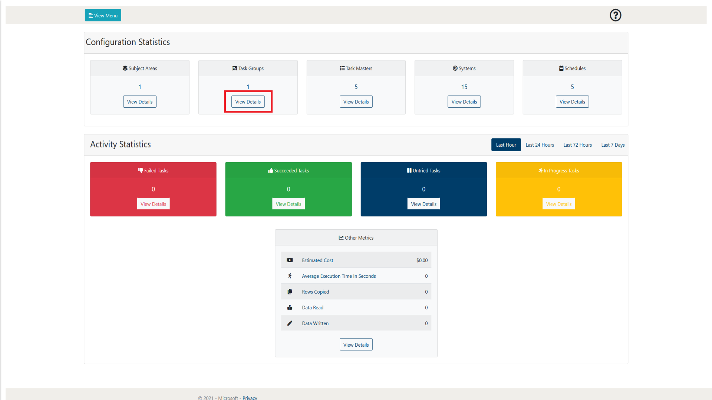
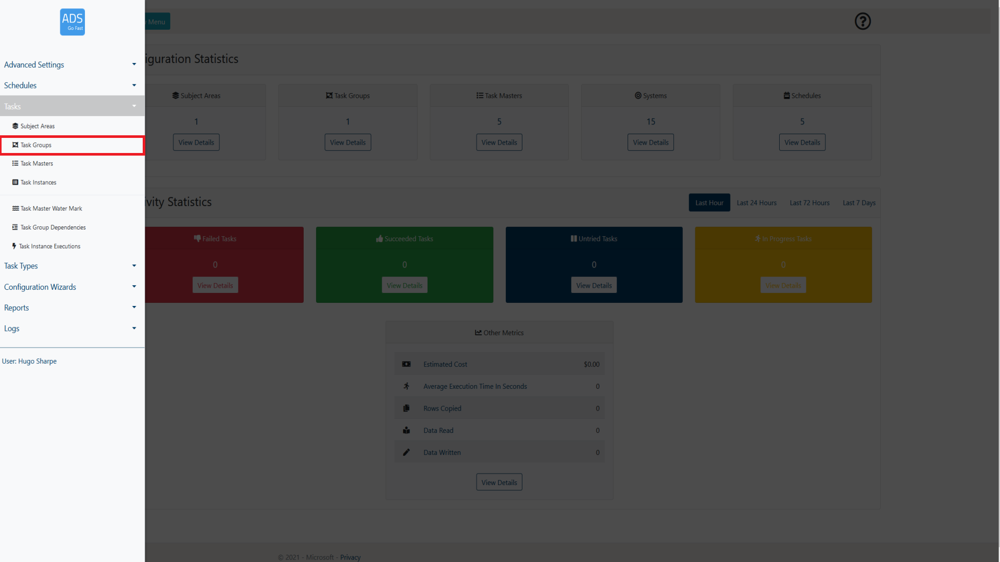
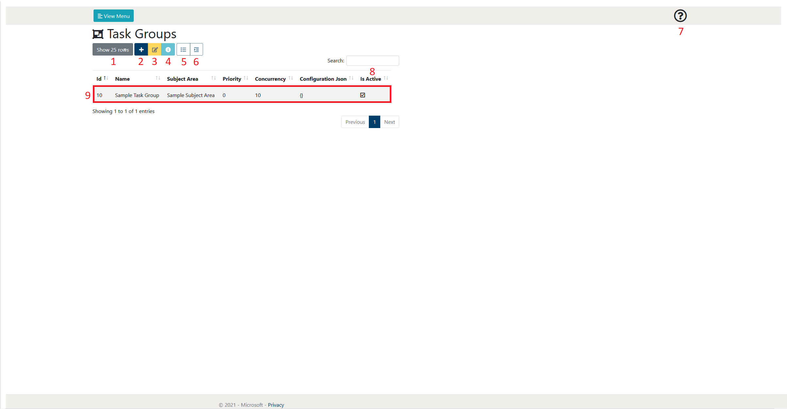
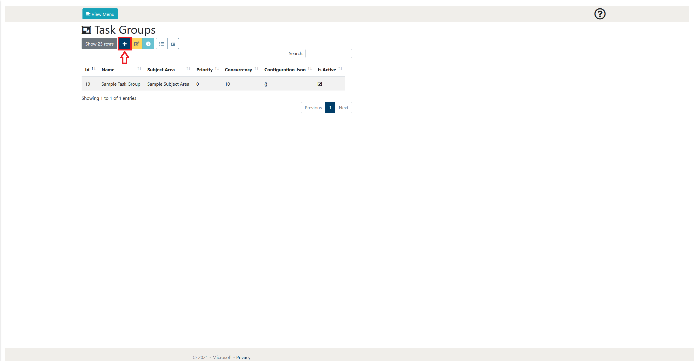
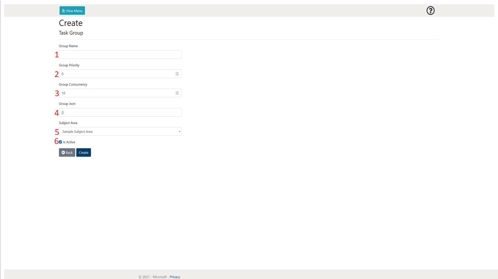

# 3. Task Groups

The following section will go into detail on how to manage and view Task
Groups from a user perspective. It will also explain the other features
that are available on the Task Group page.

The Task Group page can be accessed in two ways. As shown in figure 3-1,
it is accessible through the View Details link on the main page. The
other way is to access it through the View Menu button shown in figure
3-2 and 3-3.

 
Figure 3-1: LockBox Main Page Task Groups View Details selection  

 
Figure 3-2: LockBox Main Page View Menu selection  

 
Figure 3-3: ADSGoFast Main Page Task Groups  selection  

## 3.1        Page overview

When browsing the Task Group page, a layout similar to figure 3.1-1 will
be shown to you. Following the figure some more details will be provided
on what each of these items represent.

 
Figure 3.1-1: Task Group page overview  

<table>
<colgroup>
<col style="width: 10%" />
<col style="width: 17%" />
<col style="width: 72%" />
</colgroup>
<thead>
<tr class="header">
<th><strong>Number</strong></th>
<th><strong>Object Name</strong></th>
<th><strong>Description</strong></th>
</tr>
</thead>
<tbody>
<tr class="odd">
<td>1</td>
<td>Show rows selection</td>
<td>This allows the user to define how many rows of Task Groups they
wish to view per page. At the time of writing, the selections available
are 10, 25, 50 and 100. As can be seen in figure 3.1-1 at the bottom
right of the page there is also a page selection to be able to browse
through pages of created Task Groups</td>
</tr>
<tr class="even">
<td>2</td>
<td>Add Item</td>
<td>
This allows the user to create a new Task Group. More details of
the Task Group creation process can be found in section 3.2.

 
</td>
</tr>
<tr class="odd">
<td>3</td>
<td>Edit Item</td>
<td>This allows the user to edit the currently selected Task Group. This
will take them to a new page which holds a form that is prefilled with
the details of the selected Task Group. More details of the Task Group
creation process can be found in section 3.2.</td>
</tr>
<tr class="even">
<td>4</td>
<td>View Details</td>
<td>
This allows the user to view the details of the Task Group in a
single page format. This may be preferable if the Task Group Json is
detailed.

 
</td>
</tr>
<tr class="odd">
<td>5</td>
<td>View Task Masters</td>
<td>
This allows the user to view the Task Masters that are assigned
to the selected Task Group.

 
</td>
</tr>
<tr class="even">
<td>6</td>
<td>View Dependencies</td>
<td>This allows the user mark the Task Instance as complete. This means
that no further executions will be attempted and it is viewed as
successfully completing its task. It will be noted in the comment of the
Task Instance that this was manually updated by the user.</td>
</tr>
<tr class="odd">
<td>7</td>
<td>Help</td>
<td>This allows the user to display some help text that gives a summary
of the current web page.</td>
</tr>
<tr class="even">
<td>8</td>
<td>Search</td>
<td>This allows the user to search for a Task Groups by name. The Task
Groups displayed will only be related to the search term input by the
user.</td>
</tr>
<tr class="odd">
<td>9</td>
<td>Task Group</td>
<td>This is an example of a created Task Group. A Task group allows the
user to assign multiple Task Masters to a single entity. This entity can
then be disabled, enabled, given a priority or dependency. More details
on Task Groups can be found in section 3.2 and more details on Task
Group Dependencies can be found in section 3.3.</td>
</tr>
</tbody>
</table>

## 3.2        Creating a Task Group

This section will provide the user with an overview of the Task Group
creation process. It will step through each property of the Task Group
creation page and give details on what each of the properties do.

To initiate the creation process, we need add a new Task Group, this is
done by selecting the ‘Add Item’ button. This will then take the user to
a new page with a form listing the required parameters to create a new
Task Group. This is shown in Figure 3.2-1.

 
Figure 3.2-1: Task Group page ‘Add Item’ button  

After doing this, an image similar to Figure 3.2-2 will be visible to
the user. Following this figure a table will explain what each of the
properties are in detail.

 
Figure 3.2-2: Task Group Create Page 

<table>
<colgroup>
<col style="width: 10%" />
<col style="width: 16%" />
<col style="width: 12%" />
<col style="width: 59%" />
</colgroup>
<thead>
<tr class="header">
<th><strong>Number</strong></th>
<th><strong>Object Name</strong></th>
<th><strong>Input Type</strong></th>
<th><strong>Description</strong></th>
</tr>
</thead>
<tbody>
<tr class="odd">
<td>1</td>
<td>Group Name</td>
<td>Text</td>
<td>This allows the user to enter the name of the Task Group to be
created.</td>
</tr>
<tr class="even">
<td>2</td>
<td>Group Priority</td>
<td>Integer</td>
<td>This allows the user to assign a priority to the Task Group. A lower
integer will give the group a higher priority.</td>
</tr>
<tr class="odd">
<td>3</td>
<td>Group Concurrency</td>
<td>Integer</td>
<td>
This allows the user to assign a Concurrency to the group.
<strong>More details to be added.</strong>

 
</td>
</tr>
<tr class="even">
<td>4</td>
<td>Group Json</td>
<td>JSON</td>
<td>This is a configuration file alongside the group. If not required,
just enter ‘{}’.</td>
</tr>
<tr class="odd">
<td>5</td>
<td>Subject Area</td>
<td>Dropdown</td>
<td>This allows the user to assign a Subject Area to the Task Group,
allowing for more control over several Task Groups.</td>
</tr>
<tr class="even">
<td>8</td>
<td>Is Active</td>
<td>Checkbox</td>
<td>This allows the user to decide whether the Group will be initially
active when it is created. If a Task Group is inactive, all of its
subsequent Task Masters will not be active regardless of their
individual state.</td>
</tr>
</tbody>
</table>

After you have filled out the form with the values you are comfortable
with, select the ‘Create’ button and you will be taken back to the Task
Group page with your new Task Group being available to now use.

