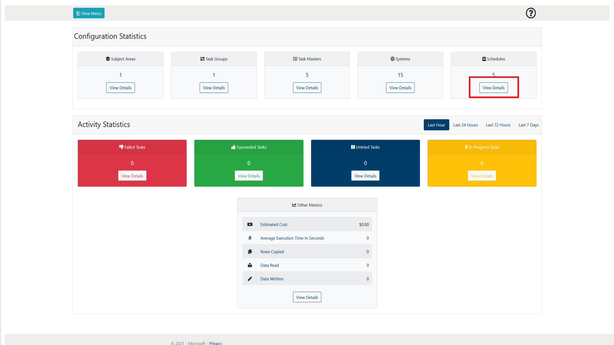
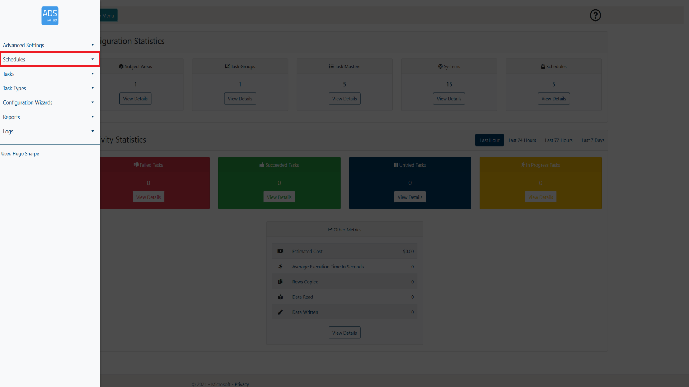
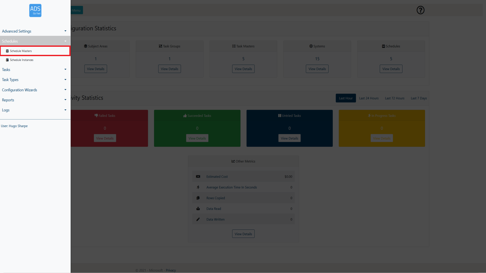
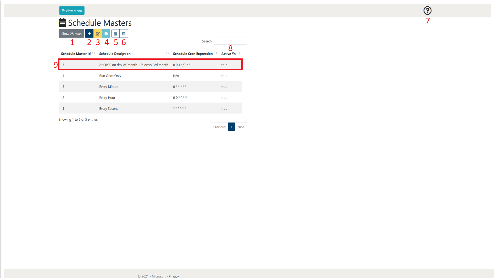
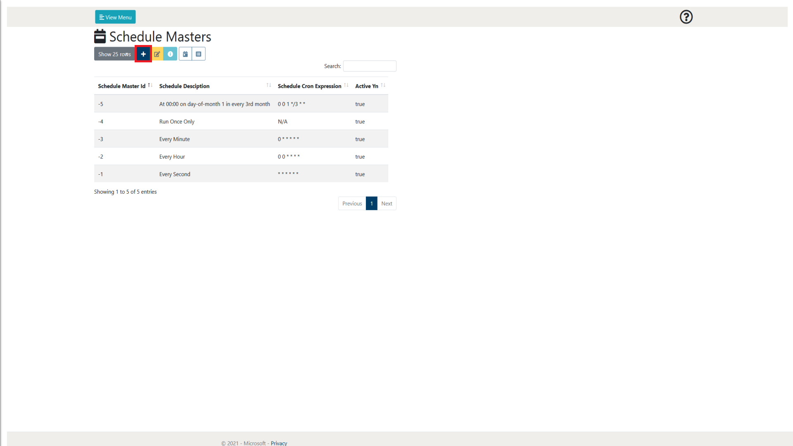
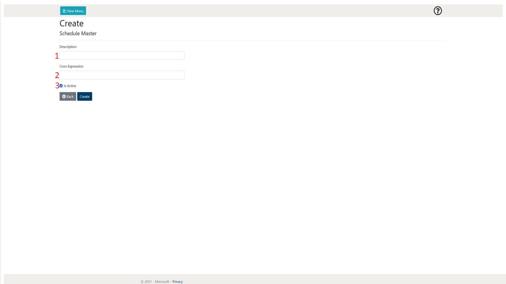
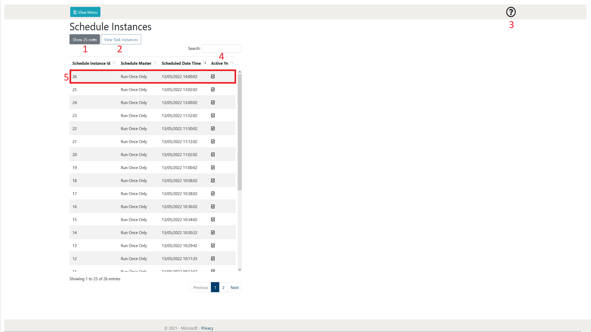

# 4. Schedules

The following section will go into detail on how to create, manage and
view Schedules from a user perspective. It will also explain the other
features that are available on the Schedule Master and Schedule
Instances pages.

The Schedule Master page can be accessed in two ways. As shown in figure
4-1, it is accessible through the View Details link on the main page.
The other way is to access it through the View Menu button shown in
figure 4-2 and 4-3.

 
Figure 4-1: LockBox Main Page Schedules View Details selection  

 
Figure 4-2: LockBox Main Page View Menu selection  

 
Figure 4-3: LockBox Main Page Schedule Masters selection  

## 4.1        Schedule Master Page Overview

When browsing the Schedule Master page, a layout similar to figure 4.1-1
will be shown to you. Following the figure some more details will be
provided on what each of these items represent.

 
Figure 4.1-1: Schedule Masters page overview  

<table>
<colgroup>
<col style="width: 10%" />
<col style="width: 14%" />
<col style="width: 75%" />
</colgroup>
<thead>
<th><strong>Number</strong></th>
<th><strong>Object Name</strong></th>
<th><strong>Description</strong></th>
</thead>
<tbody>
<tr class="odd">
<td>1</td>
<td>Show rows selection</td>
<td>This allows the user to define how many rows of Schedule Masters
they wish to view per page. At the time of writing, the selections
available are 10, 25, 50 and 100. As can be seen in figure 4.1-1 at the
bottom right of the page there is also a page selection to be able to
browse through pages of created Schedule Masters.</td>
</tr>
<tr class="even">
<td>2</td>
<td>Add Item</td>
<td>
This allows the user to create a new Schedule Master. More
details of the Schedule creation process can be found in section
342.

 
</td>
</tr>
<tr class="odd">
<td>3</td>
<td>Edit Item</td>
<td>This allows the user to edit the currently selected Schedule Master.
This will take them to a new page which holds a form that is prefilled
with the details of the selected Schedule. More details of the Schedule
Master creation process can be found in section 4.2.</td>
</tr>
<tr class="even">
<td>4</td>
<td>View Details</td>
<td>
This allows the user to view the details of the Schedule in a
single page format. This may be preferable to view the Cron Expression
in detail.

 
</td>
</tr>
<tr class="odd">
<td>5</td>
<td>View Schedule Instances</td>
<td>This allows the user to view the Schedule Instances that have been
executed in relation to the selected Schedule Master. More details on
Schedule Instances can be found in section 4.3.</td>
</tr>
<tr class="even">
<td>6</td>
<td>View Task Masters</td>
<td>
This allows the user to view the Task Masters that are assigned
to the selected Task Group.

 
</td>
</tr>
<tr class="odd">
<td>7</td>
<td>Help</td>
<td>This allows the user to display some help text that gives a summary
of the current web page.</td>
</tr>
<tr class="even">
<td>8</td>
<td>Search</td>
<td>This allows the user to search for a Schedule Masters by name. The
Schedule Masters displayed will only be related to the search term input
by the user.</td>
</tr>
<tr class="odd">
<td>9</td>
<td>Schedule Master</td>
<td>This is an example of a created Schedule Master. A Schedule allows
the user to define a Cron expression that the function app will run
against. The functon app will check all of the Schedules to see their
specific Cron expression has met its criteria, and if so, it will create
Task Instances for any of the enabled Task Masters that are assigned to
the related Schedule Master</td>
</tr>
</tbody>
</table>

## 4.2        Creating a Schedule Master

This section will provide the user with an overview of the Schedule
Master creation process. It will step through each property of the
Schedule Master creation page and give details on what each of the
properties do.

To initiate the creation process, we need add a new Schedule, this is
done by selecting the ‘Add Item’ button. This will then take the user to
a new page with a form listing the required parameters to create a new
Task Group. This is shown in Figure 4.2-1.

 
Figure 4.2-1: Schedule Master page ‘Add Item’ button 

After doing this, an image similar to Figure 4.2-2 will be visible to
the user. Following this figure a table will explain what each of the
properties are in detail.

 
Figure 4.2-1: Schedule Master page ‘Add Item’ button 

<table>
<colgroup>
<col style="width: 8%" />
<col style="width: 10%" />
<col style="width: 10%" />
<col style="width: 70%" />
</colgroup>
<thead>
<th><strong>Number</strong></th>
<th><strong>Object Name</strong></th>
<th><strong>Input Type</strong></th>
<th><strong>Description</strong></th>
</thead>
<tbody>
<tr class="odd">
<td>1</td>
<td>Description</td>
<td>Text</td>
<td>This allows the user to enter the name of the Task Group to be
created.</td>
</tr>
<tr class="even">
<td>2</td>
<td>Cron Expression</td>
<td>Cron Expression</td>
<td>
This allows the user to assign a Cron expression for the
Schedule. The Function app will check to see if the Schedule has had its
criteria met every two minutes. For more information on Cron
Expressions:

<a
href="https://docs.oracle.com/cd/E12058_01/doc/doc.1014/e12030/cron_expressions.htm">https://docs.oracle.com/cd/E12058_01/doc/doc.1014/e12030/cron_expressions.htm</a>
</td>
</tr>
<tr class="odd">
<td>3</td>
<td>Is Active</td>
<td>Checkbox</td>
<td>This allows the user to decide whether the Group will be initially
active when it is created. If a Schedule is inactive, all of its
subsequent Task Masters will not be active regardless of their
individual state.</td>
</tr>
</tbody>
</table>

## 4.3        Schedule Instances

The following section will go into detail on how to manage and view
Schedule Instances from a user perspective. It will also explain the
other features that are available on the Schedule Instances page.

The Schedule Instances page can be accessed through the menu. As shown
in figure 4.3-1 and 4.3-2, it is accessible through the View Menu
button.

 
Figure 4.3-1: LockBox Main Page View Menu selection 

 
Figure 4.3-2: LockBox Main Page Schedule Instances selection 

### 4.3.1   Page overview

When browsing the Schedule Instances page, a layout similar to figure
4.3.1-1 will be shown to you. Following the figure some more details
will be provided on what each of these items represent.

 
Figure 4.3.1-1: Schedule Instances page overview 

| **Number** | **Object Name**     | **Description**                                                                                                                                                                                                                                                                                                                        |
|------------|---------------------|----------------------------------------------------------------------------------------------------------------------------------------------------------------------------------------------------------------------------------------------------------------------------------------------------------------------------------------|
| 1          | Show rows selection | This allows the user to define how many rows of Schedule Instances they wish to view per page. At the time of writing, the selections available are 10, 25, 50 and 100. As can be seen in figure 2.1-1 at the bottom right of the page there is also a page selection to be able to browse through pages of created Schedule Instances |
| 2          | View Task Instances | This allows the user to view the Task Instances that have been created due to the creation of the Schedule Instance selected.                                                                                                                                                                                                          |
| 3          | Help                | This allows the user to display some help text that gives a summary of the current web page.                                                                                                                                                                                                                                           |
| 4          | Search              | This allows the user to search for a Schedule Instance by name. The Schedule Instances displayed will only be related to the search term input by the user.                                                                                                                                                                            |
| 5          | Schedule Instance   | This is an example of a created Schedule Instance. A schedule instance is created due its correlating Schedule Master having its cron expression meet its criteria. For more information on Schedule Masters refer to section 4.2                                                                                                      |
