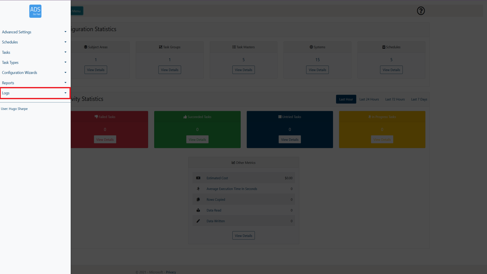
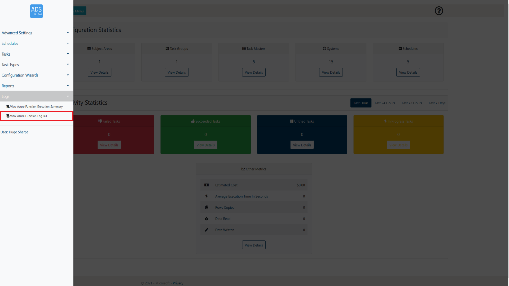
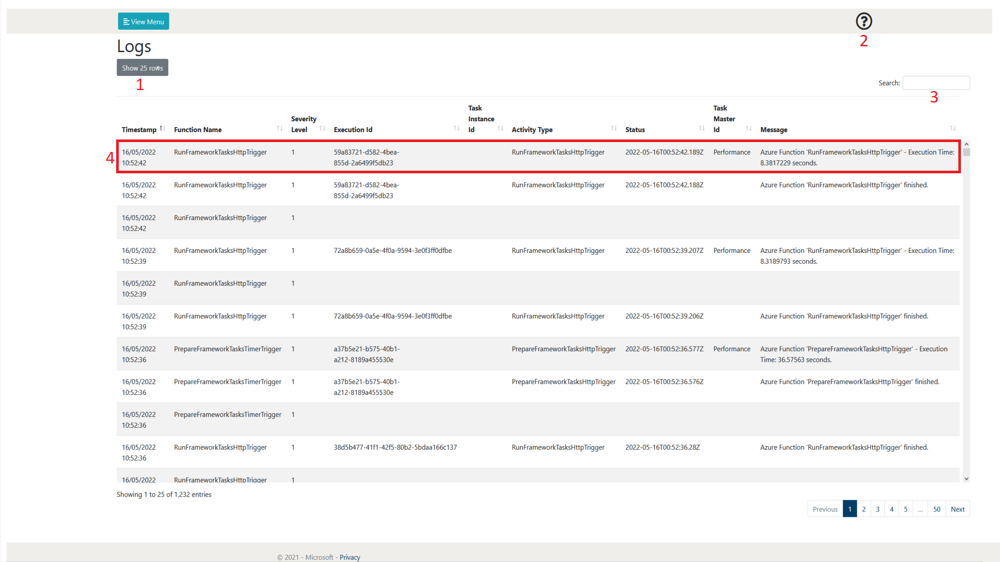
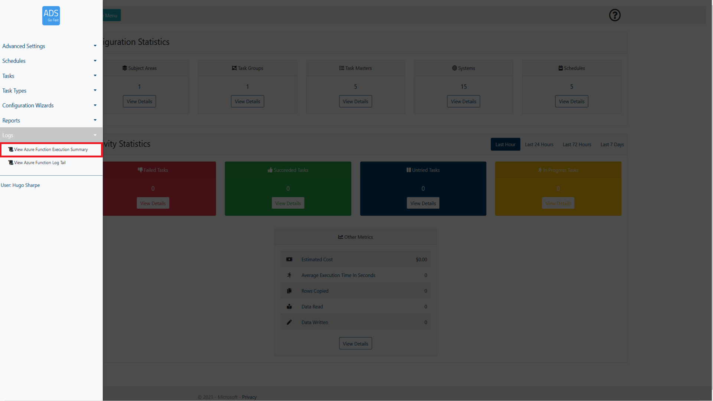
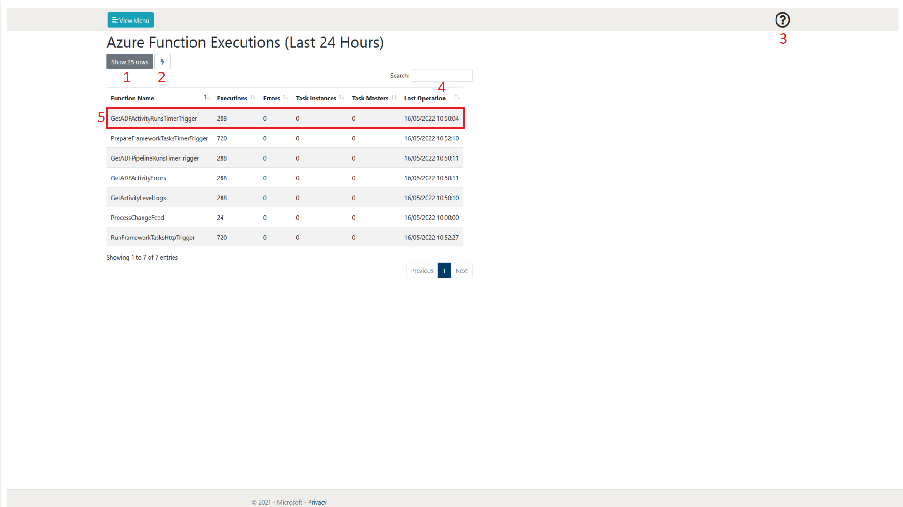

# 5. Logs

The following section will go into detail on how to manage and view Logs
from a user perspective. It will explain the difference between the
Azure Function Execution Summary and the Azure Function Log Tail.

Logs can also be viewed by accessing the Function App and also viewing
your application insights logs.

## 5.1        Azure Function Log Tail

The Azure Function Log Tail page can be accessed through the menu. As
shown in figure 5.1-1 and 5.1-2, it is accessible through the View Menu
button.

 
Figure 5.1-1: LockBox Main Page View Menu selection  

 
Figure 5.1-2: LockBox Main Page Azure Function Log Tail selection  

### 5.1.1   Page Overview

The Azure Function Log Tail allows you to view and search every single
function execution that has been made. This means you can monitor and
find any issues that may occur. Most error messages have been customized
to point to the reason for their existence however if you are unsure of
the reason why, or you believe that the error is within the function app
itself, please make an issue on the github.

When browsing the Azure Function Log Tail page, a layout similar to
figure 5.1.1-1 will be shown to you. Following the figure some more
details will be provided on what each of these items represent.

 
Figure 5.1.1-1: Azure Function Log Tail page overview  

| **Number** | **Object Name**     | **Description**                                                                                                                                                                                                                                                                                                            |
|------------|---------------------|----------------------------------------------------------------------------------------------------------------------------------------------------------------------------------------------------------------------------------------------------------------------------------------------------------------------------|
| 1          | Show rows selection | This allows the user to define how many rows of Task Masters they wish to view per page. At the time of writing, the selections available are 10, 25, 50 and 100. As can be seen in figure 2.1-1 at the bottom right of the page there is also a page selection to be able to browse through pages of created Task Masters |
| 2          | Help                | This allows the user to display some help text that gives a summary of the current web page.                                                                                                                                                                                                                               |
| 3          | Search              | This allows the user to search for a Log by name. The Logs displayed will only be related to the search term input by the user.                                                                                                                                                                                            |
| 4          | Log                 | This is an example of a Function execution Log. These logs will display their relevant details such as the function being executed and any relevant log messages (especially important for errors) that may be accompanied with the function execution.                                                                    |

## 5.2        Azure Function Execution Summary

The Azure Function Log Tail page can be accessed through the menu. As
shown in figure 5.2-1 and 5.2-2, it is accessible through the View Menu
button.

 
Figure 5.2-1: LockBox Main Page View Menu selection  

 
Figure 5.2-2: LockBox Main Page Azure Function Execution Summary selection  

### 5.2.1   Page Overview

The Azure Function Summary Execution allows you to view a summary of
each function and its executions. This page allows you to view the logs
of specific functions and view any errors associated with that function.
This can be useful for finding where any errors may be occurring and
why. Most error messages have been customized to point to the reason for
their existence however if you are unsure of the reason why, or you
believe that the error is within the function app itself, please make an
issue on the github.

When browsing the Azure Function Execution Summary page, a layout
similar to figure 5.2.1-1 will be shown to you. Following the figure
some more details will be provided on what each of these items
represent.

 
Figure 5.2.1-1: Azure Function Execution Summary page overview  

| **Number** | **Object Name**     | **Description**                                                                                                                                                                                                                                                                                                                              |
|------------|---------------------|----------------------------------------------------------------------------------------------------------------------------------------------------------------------------------------------------------------------------------------------------------------------------------------------------------------------------------------------|
| 1          | Show rows selection | This allows the user to define how many rows of logs they wish to view per page. At the time of writing, the selections available are 10, 25, 50 and 100. As can be seen in figure 2.1-1 at the bottom right of the page there is also a page selection to be able to browse through pages of created logs                                   |
| 3          | View Errors         | This allows the user to view the errors associated with the selected Function. If a certain function is throwing continuous errors this can be extremely helpful in finding out the reason why.                                                                                                                                              |
| 2          | Help                | This allows the user to display some help text that gives a summary of the current web page.                                                                                                                                                                                                                                                 |
| 3          | Search              | This allows the user to search for a Log by name. The Logs displayed will only be related to the search term input by the user.                                                                                                                                                                                                              |
| 4          | Function            | This is an example of a Function execution Log summary. This represents all of the logs associated with that specific function. A summary of execution and any errors within executions will be visible here. More details about errors associated with a function can be viewed by selecting a function name and hitting ‘View Errors’ (2). |
