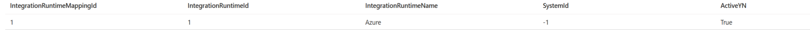
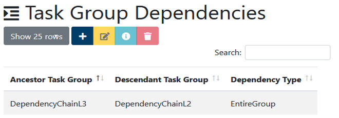
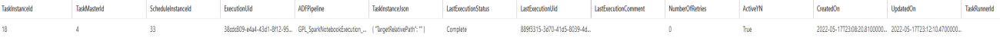

# MetaDataDB Tables

This section will aim to break down some of the tables within the
MetaDataDB and explain how they relate to the Web Application. All
examples used within the table are grabbed from a standard deployment of
the Lockbox.

<table>
<colgroup>
<col style="width: 37%" />
<col style="width: 62%" />
</colgroup>
<thead>
<th><strong>Table</strong></th>
<th><strong>Detail</strong></th>
</thead>
<tbody>
<tr class="odd">
<td>dbo.ExecutionEngine</td>
<td><p>This table holds the details of each of the execution engines
available for use within the WebApp. At the time of writing, an
Execution Engine can be either a Azure Data Datafactory or Synapse
Workspace.</p>
<p><strong>Row:</strong></p>

</br>

<p><strong>WebApp:</strong> /ExecutionEngine/IndexDataTable</p>

</br>


</tr>
<tr class="even">
<td>dbo.ExecutionEngine_JsonSchema</td>
<td><p>This table directly relates to the EngineJson field of the
ExecutionEngine table. A EngineJson is checked against the corresponding
schema from the ExecutionEngine_JsonSchema table to ensure that it
adheres to the proper layout and has the required fields.</p>
<p><strong>EngineJson:</strong></p>

```
{
    "endpoint": "https://arkstgsynwadsxjp4.dev.azuresynapse.net",
    "DeltaProcessingNotebook": "DeltaProcessingNotebook",
    "PurviewAccountName": "dlzdev07purv",
    "DefaultSparkPoolName": "Dummy"
}
```

<p><strong>JsonSchema:</strong></p>

```
{
    "$schema": "http://json-schema.org/draft-04/schema#",
    "type": "object",
    "properties": {
        "endpoint": {
            "type": "string"
        }
    },
    "required": [
        "endpoint"
    ]
}
```

</tr>
<tr class="odd">
<td>dbo.FrameworkTaskRunner</td>
<td><p>This table holds the details of each Framework Task Runner
available for use within the WebApp. These task runners are what execute
the tasks of the WebApp. Having more task runners will cause a higher
demand so it’s up to the user whether they wish to change the amount
from the default (4).</p>
<p><strong>Row:</strong></p>

</br>


<p><strong>WebApp:</strong> /FrameworkTaskRunner/IndexDataTable</p>

</br>


</tr>
<tr class="even">
<td>dbo.IntegrationRuntime</td>
<td><p>This table holds the details of each integration runtime that the
framework will use to execute the pipelines within their corresponding
execution engine. Each execution engine can have multiple integration
runtimes (such as an automatic and on premises) but you must ensure that
the IntegrationRuntimeName matches the name of it exactly within the
execution engine.</p>
<p><strong>Row:</strong></p>

</br>


<p><strong>WebApp:</strong> /IntegrationRuntime/IndexDataTable</p>

</br>


</tr>
<tr class="odd">
<td>dbo.IntegrationRuntimeMapping</td>
<td><p>This table is used to map each integration runtime against the
corresponding source and target systems. Before passing the task to the
execution engine, the function application will check that both the
source and target can use the relevant integration runtime. This is done
by checking if there is a mapping for both the source and target for
that integration runtime. If there is, within step 5 of the Task Master
creation process, the integration runtime will be available as one of
the drop down selections. If you add a new system to the
SourceAndTargetSystems table, ensure that it has been given relevant
mapping in this table otherwise the WebApp will throw an error and let
you know there are no acceptable integration runtime mappings for the
source or target.</p>
<p><strong>Row:</strong></p>

</br>


<p><strong>WebApp:</strong> /TaskMaster/Create#step-5</p>

</br>


</tr>
<tr class="even">
<td>dbo.ScheduleInstance</td>
<td><p>This table is used to represent the schedule instances that have
been created from the corresponding schedule master.</p>
<p><strong>Row:</strong></p>

</br>


<p><strong>WebApp:</strong> /ScheduleInstance/IndexDataTable</p>

</br>


</tr>
<tr class="odd">
<td>dbo.ScheduleMaster</td>
<td><p>This table is used to store the schedule masters that have been
created by the user. For more information regarding creating a Schedule
Master, refer to the Schedule section of the Web Application Manual.</p>
<p><strong>Row:</strong></p>

</br>


<p><strong>WebApp:</strong> /ScheduleMaster/IndexDataTable</p>

</br>


</tr>
<tr class="even">
<td>dbo.SourceAndTargetSystems</td>
<td><p>This table is used to store the source and target systems used
within the Lockbox. Each system registered here will be able to be
selected in step 2 and/or step 3 depending on the Task Type it is
associated with. The SystemType must match up with one of the SystemType
rows within the SourceAndTargetSystems_JsonSchema, and the SystemJson
must match the schema requirements of the corresponding JsonSchema. More
details about this will follow.</p>
<p><strong>Row:</strong></p>

</br>


<p><strong>WebApp:</strong> /TaskMaster/Create#step-2 OR
/TaskMaster/Create#step-3</p>

</br>


</tr>
<tr class="odd">
<td>dbo.SourceAndTargetSystems_JsonSchema</td>
<td><p>This table is used to verify the SystemJson of the
SourceAndTargetSystems against the corresponding JsonSchema within the
SourceAndTargetSystems_JsonSchema. It matches the jsons by the
SystemType field. It is important these match as the json contains
information that the execution engines use to be able to interact with
the system.</p>
<p><strong>SystemJson:</strong></p>

```
{
    "Container": "datalakeraw"
}
```
<p><strong>JsonSchema:</strong></p>

```
{
    "$schema": "http://json-schema.org/draft-04/schema#",
    "type": "object",
    "properties": {
        "Container": {
            "type": "string"
        }
    },
    "required": [
        "Container"
    ]
}
```
</tr>
<tr class="even">
<td>dbo.TaskGroup</td>
<td><p>This table is used to store the task groups that have been
created by the user. For more information regarding creating a task
groups, refer to the Task Groups section of the Web Application
Manual.</p>
<p><strong>Row:</strong></p>

</br>

<p><strong>WebApp:</strong> /TaskGroup/IndexDataTable</p>

</br>

</tr>
<tr class="odd">
<td>dbo.TaskGroupDependency</td>
<td><p>This table is used to store the task group dependencies that have
been created by the user. For more information regarding creating a task
group dependencies, refer to the Task Groups section of the Web
Application Manual.</p>
<p><strong>Row:</strong></p>

</br>


<p><strong>WebApp:</strong> /TaskGroupDependency/IndexDataTable</p>

</br>

</tr>
<tr class="even">
<td>dbo.TaskInstance</td>
<td><p>This table is used to store the task instances that have been
created from their corresponding Task Master. For more information
regarding task instances, refer to the Task Instances section of the Web
Application Manual.</p>
<p><strong>Row:</strong></p>

</br>

<p><strong>WebApp:</strong> /TaskInstance/IndexDataTable</p>

</br>


</tr>
<tr class="odd">
<td>dbo.TaskInstanceExecution</td>
<td><p>This table is used to store the task instance executions that
have been created from their corresponding Task Instance. For more
information regarding task instance executions, refer to the Task
Instances section of the Web Application Manual.</p>
<p><strong>Row:</strong></p>

</br>

<p><strong>WebApp:</strong> /TaskInstanceExecution/IndexDataTable</p>

</br>

</tr>
<tr class="even">
<td>dbo.TaskMaster</td>
<td><p>This table is used to store the task masters that have been
created. For more information regarding task masters, refer to the Task
Master section of the Web Application Manual.</p>
<p><strong>Row:</strong></p>

</br>

<p><strong>WebApp:</strong> /TaskMaster/IndexDataTable</p>

</br>


</tr>
<tr class="odd">
<td>dbo.TaskMasterWaterMark</td>
<td><p>This table is used to store the task master water marks that have
been created. For more information regarding task masters water marks,
refer to the Task Master section of the Web Application Manual.</p>
<p><strong>Row:</strong></p>

</br>

<p><strong>WebApp:</strong> /TaskMasterWaterMark/IndexDataTable</p>

</br>

</tr>
<tr class="even">
<td>dbo.TaskType</td>
<td><p>This table is used to store the task types that have been
created. Task Types define what the overall objective of a Task Master
is (step 1 of the task master creation wizard). Each Task Type will have
a set of mapping that will define what the task can set as its source
and what it can set as its target in regards to systems. A Task Type is
the overarching control of a Task. For more information regarding task
types, refer to the Task Master section of the Web Application
Manual.</p>
<p><strong>Row:</strong></p>

</br>

<p><strong>WebApp:</strong> /TaskMaster/Create#step-1</p>

</br>

</tr>
<tr class="odd">
<td>dbo.TaskTypeMapping</td>
<td><p> This table is used to store the mappings for any Task Type. A
Task Type Mapping will define what combinations of sources and targets
are possible for a specific task type (step 2 and 3 within the task
master creation wizard). It will also define what source and target sub
types are available for those correlating sources and targets (step 4
within the task master creation wizard).</p>
<p>This means that every row will define ONE possible combination of a
task masters' Source/Target/Source sub-type/Target sub-type. It will
also hold a TaskMasterJsonSchema that will be checked against, meaning
that if a task master has been created that does not fit the schema
provided for that task type mapping, it will be an invalid task and
throw an error before attempting to execute that task. This Schema is
also used by the Web Application to create the web form for user
input.</p>
<p><strong>Row:</strong></p>

</br>

<p><strong>TaskMasterJsonSchema:</strong></p>

```
{
    "$schema": "http://json-schema.org/draft-04/schema#",
    "properties": {
        "ExecuteNotebook": {
            "default": "RestAPINotebook",
            "options": {
                "infoText": "WARNING: Only change this if you wish to use a custom notebook for the REST API procedure.",
                "inputAttributes": {
                    "placeholder": "RestAPINotebook"
                }
            },
            "type": "string"
        },
        "Purview": {
            "default": "Disabled",
            "enum": [
                "Enabled",
                "Disabled"
            ],
            "options": {
                "infoText": "Use this to enable the pipeline to be written to purview. Note: This will not work if Purview is not enabled and configured with the ExecutionEngine."
            },
            "type": "string"
        },
        "QualifiedIDAssociation": {
            "default": "TaskMasterId",
            "enum": [
                "ExecutionId",
                "TaskMasterId"
            ],
            "options": {
                "infoText": "This is used to enable Purview to direct the QualifiedID (UID) to attach itself to the relevant ID. Note: If attached to the ExecutionID each indiviudal run of the pipeline with have a lineage."
            },
            "type": "string"
        },
        "Source": {
            "properties": {
                "RelativeUrl": {
                    "default": "",
                    "options": {
                        "infoText": "The relative URL of the API base URL you wish to use. This is amended to the base URL that is stored in the source system selected.",
                        "inputAttributes": {
                            "placeholder": "eg. /users"
                        }
                    },
                    "type": "string"
                },
                "RequestBody": {
                    "default": "",
                    "options": {
                        "infoText": "The request body being used for the request method chosen. Note: A GET RequestBody will not use this.",
                        "inputAttributes": {
                            "placeholder": ""
                        }
                    },
                    "type": "string"
                },
                "RequestMethod": {
                    "default": "GET",
                    "enum": [
                        "GET",
                        "POST"
                    ],
                    "options": {
                        "infoText": "This is the Request Method you wish to use for the API request. A GET request will not require a Request Body but other selections will"
                    },
                    "type": "string"
                },
                "Type": {
                    "default": "Rest",
                    "enum": [
                        "Rest"
                    ],
                    "options": {
                        "hidden": true
                    },
                    "type": "string"
                }
            },
            "required": [
                "RelativeUrl",
                "RequestMethod"
            ],
            "type": "object"
        },
        "Target": {
            "properties": {
                "DataFileName": {
                    "options": {
                        "infoText": "Name of the file that will hold the extracted data",
                        "inputAttributes": {
                            "placeholder": "dbo.Customer.parquet"
                        }
                    },
                    "type": "string"
                },
                "RelativePath": {
                    "options": {
                        "infoText": "The path of the directory into which you want your extracted data to be written. You can use placeholders such (eg. {yyyy}/{MM}/{dd}/{hh}/). ",
                        "inputAttributes": {
                            "placeholder": "AwSample/dbo/Customer/{yyyy}/{MM}/{dd}/{hh}/"
                        }
                    },
                    "type": "string"
                },
                "Type": {
                    "enum": [
                        "Json"
                    ],
                    "options": {
                        "hidden": true,
                        "infoText": "Presently only Json is supported"
                    },
                    "type": "string"
                }
            },
            "required": [
                "Type",
                "RelativePath",
                "DataFileName"
            ],
            "type": "object"
        },
        "UseNotebookActivity": {
            "default": "Disabled",
            "enum": [
                "Enabled",
                "Disabled"
            ],
            "options": {
                "infoText": "This flag is used to control the method used to call the Synapse Notebook that carries out the processing. When Enabled the default notebook activity type within Synapse pipelines will be used. Note that this will force a new spark session for each job execution. By leaving this flag disabled an Azure Function is used to call the notebook and Spark Sessions will be reused if available."
            },
            "type": "string"
        }
    },
    "required": [
        "ExecuteNotebook",
        "Purview",
        "UseNotebookActivity"
    ],
    "title": "TaskMasterJson",
    "type": "object"
}
```
<p><strong>Completed Task Master Json:</strong></p>

```
{
    "ExecuteNotebook": "RestAPINotebook",
    "Purview": "Disabled",
    "QualifiedIDAssociation": "TaskMasterId",
    "Source": {
        "RelativeUrl": "/facts?limit=50",
        "RequestBody": "{\"test\": { \"Ignored\": \"I should be\"}}",
        "RequestMethod": "GET",
        "Type": "Rest"
    },
    "Target": {
        "DataFileName": "testNoAuth.json",
        "RelativePath": "",
        "Type": "Json"
    },
    "UseNotebookActivity": "Enabled"
}
```
</tr>
</tbody>
</table>
