# 8. Security & Permissions

The following section will go into detail on how to manage security and
grant permissions to users of the Web Application. This can be done in
two main ways:

1.  Granting permissions in Azure Active Directory as an overarching
    role for users or security groups.

2.  Granting permissions within the Web Application to grant users the
    ability to modify specific objects (such as a specific Execution
    Engine).

## 8.1 Azure Active Directory

The Web Application has the ability to check users or groups against App
roles that have been granted to them through the ADS GoFast Web Portal
App registration and enterprise application. Below is a small step by
step guide on how to view and assign a role to a group or user for the
Web Application within Azure Active Directory.

### 8.1.1 Step 1 - Creating the App Role

The first thing you will need to do is locate your app registration for
your web application.

Note: If you have deployed using the prepare.ps1 script then the name of
your app registration will most likely be “ADS GoFast Web Portal
(*environment tag*)”.

After this, locate the App roles tab and select it as shown in figure
8.1.1-1.

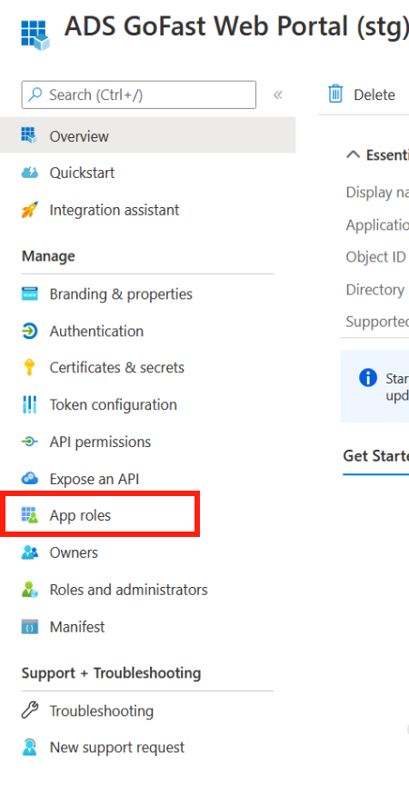 
Figure 8.1.1-1: WebApp App Registration page  

If you already have the roles you require, then you can proceed to step
2, otherwise, you now need to create a new app role as shown in figure
8.1.1-2

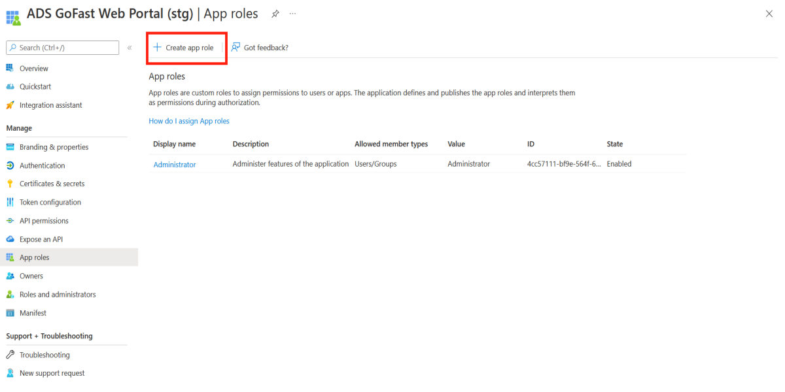 
Figure 8.1.1-2: WebApp App Registration create App role  

-   For the Display name and Value, make sure to use the name of one of
    the current roles available for use as seen in section 8.3.

-   For the Allowed member types, ensure you have Users/Groups selected.

-   Description is up to the user.

-   Ensure that the app role is enabled.

-   After you have filled in the details, select Apply.

A completed App role can be seen in figure 8.1.1-3.

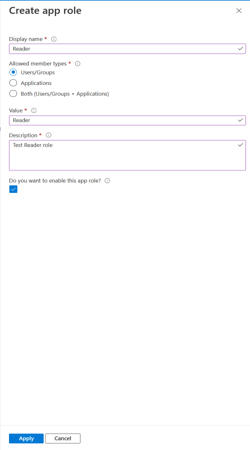 
Figure 8.1.1-3: WebApp App Registration completed App role  

### 8.1.2 Step 2 - Assigning the App role to a group or user

Once you have your app role created, you will need to assign it to your
group or user. The first thing you will need to do is browse to the
managed application in the local directory or the Enterprise Application
of the Web App.

After this, locate the Users and groups tab and select it as shown in
figure 8.1.2-1.

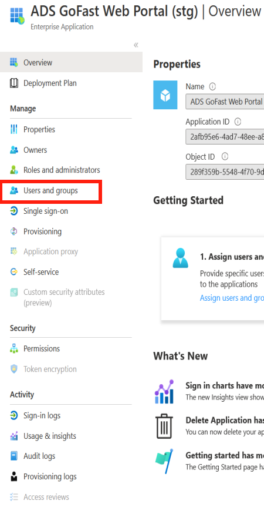 
Figure 8.1.2-1: WebApp App Enterprise Application overview  

The next step is to add a new user/group as shown in figure 8.1.2-2.
Note: If you already have a user or group you want to modify, ensure you
select and edit that instead.

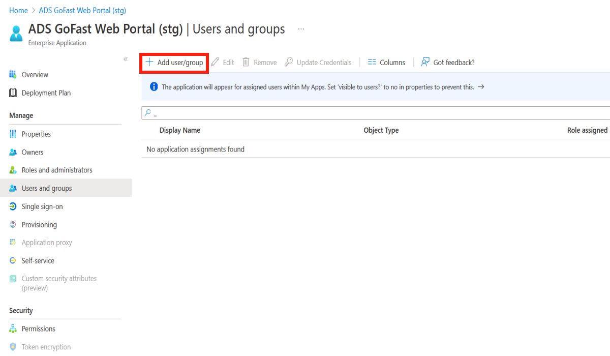 
Figure 8.1.2-2: WebApp App Enterprise Application add user/group  

You will then need to select the user and/or groups you want to assign
the role to. After doing so, you need to select a role, ensure that it
is the correct role and it is one that is applicable to the Web App. You
should notice if you created an app role in the previous step it is
available to be used.

A completed assignment is shown in figure 8.1.2-3.

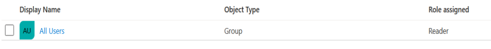 
Figure 8.1.2-3: WebApp App Enterprise Application completed assignment  

Your user(s) should now have the correct corresponding permissions to
the role granted to them when accessing the Web App.

## 8.2 Web Application

The Web Application allows Administrators to grant permissions to users
to allow them to have specific roles against specific entities. This
allows for tighter control as a user or group can be given role
permissions for single objects that may be applicable to them and their
needs.

The Entity Role Map page can be accessed through the View Menu button
shown in figure 8-1 and 8-2.

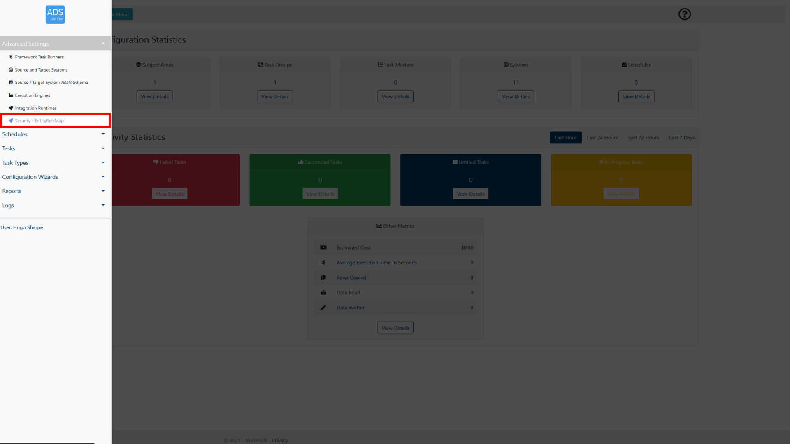 
Figure 8.2-1: LockBox Main Page View Menu selection  

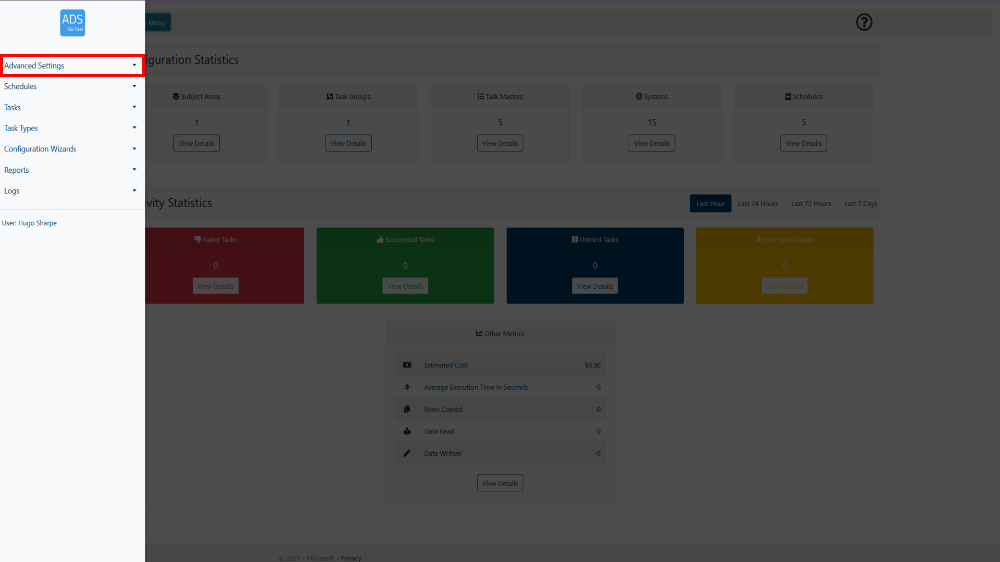 
Figure 8.2-2: LockBox Main Page EntityRoleMap selection  

### 8.2.1 EntityRoleMap Page Overview

When browsing the EntityRoleMap page, a layout similar to figure 8.2.1-1
will be shown to you. Following the figure some more details will be
provided on what each of these items represent.

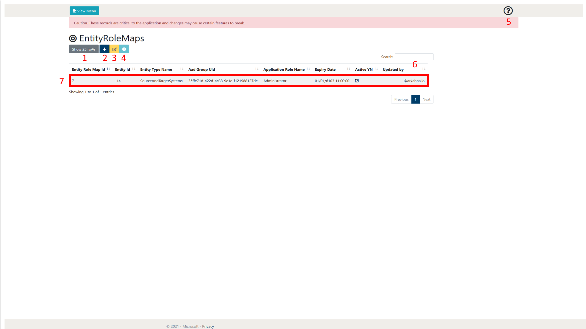 
Figure 8.2.1-1: EntityRoleMap page overview  

<table>
<colgroup>
<col style="width: 10%" />
<col style="width: 12%" />
<col style="width: 76%" />
</colgroup>
<thead>
<tr class="header">
<th><strong>Number</strong></th>
<th><strong>Object Name</strong></th>
<th><strong>Description</strong></th>
</tr>
</thead>
<tbody>
<tr class="odd">
<td>1</td>
<td>Show rows selection</td>
<td>This allows the user to define how many rows of EntityRoleMaps they
wish to view per page. At the time of writing, the selections available
are 10, 25, 50 and 100. As can be seen in figure 8.2.1-1 at the bottom
right of the page there is also a page selection to be able to browse
through pages of created EntityRoleMaps.</td>
</tr>
<tr class="even">
<td>2</td>
<td>Add Item</td>
<td>
This allows the user to create a new Entity Role Map. More
details of the creation process can be found in section 8.2.2.

 
</td>
</tr>
<tr class="odd">
<td>3</td>
<td>Edit Item</td>
<td>This allows the user to edit the currently selected Entity Role Map.
This will take them to a new page which holds a form that is prefilled
with the details of the selected Entity Role Map. More details of the
Entity Role Map creation process can be found in section 8.2.2.</td>
</tr>
<tr class="even">
<td>4</td>
<td>View Details</td>
<td>This allows the user to view the details of the Entity Role Map in a
single page format.</td>
</tr>
<tr class="odd">
<td>5</td>
<td>Help</td>
<td>This allows the user to display some help text that gives a summary
of the current web page.</td>
</tr>
<tr class="even">
<td>6</td>
<td>Search</td>
<td>This allows the user to search for a Entity Role Maps by Type. The
Entity Role Maps displayed will only be related to the search term input
by the user.</td>
</tr>
<tr class="odd">
<td>7</td>
<td>Entity Role Map</td>
<td>This is an example of a created Entity Role Map. This represents a
permission given to a group that is tied to a specific entity. It will
allow the users within the group to interact with that entity with the
permissions that are also listed in the mapping. The Updated by column
is automatically filled in when a record is completed or modified with
the corresponding email address of the user.</td>
</tr>
</tbody>
</table>

### 8.2.2 Creating a permission

This section will provide the user with an overview of the Entity Role
Map creation process. It will step through each property of the Entity
Role Map creation page and give details on what each of the properties
do.

To initiate the creation process, we need add a new Entity Role Map,
this is done by selecting the ‘Add Item’ button. This will then take the
user to a new page with a form listing the required parameters to create
a new permission mapping. This is shown in Figure 8.2.2-1.

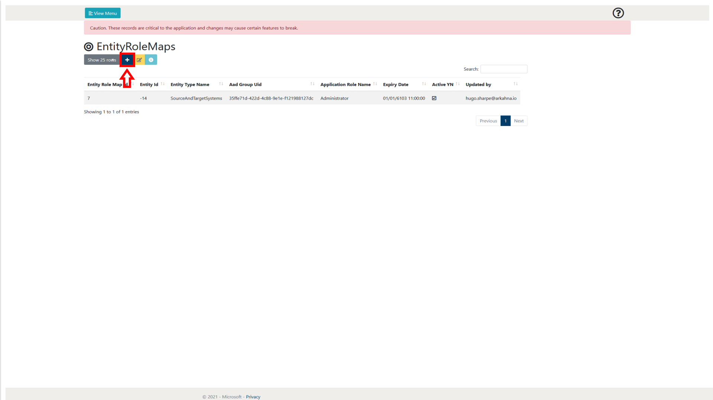 
Figure 8.2.2-1: EntityRoleMap page Add Item button  

After doing this, an image similar to Figure 8.2.2-2 will be visible to
the user. Following this figure a table will explain what each of the
properties are in detail.

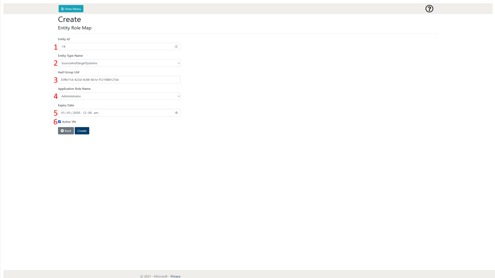 
Figure 8.2.2-2: EntityRoleMap page create item page overview  

| **Number** | **Object Name**       | **Input Type** | **Description**                                                                                                                                                                                |
|------------|-----------------------|----------------|------------------------------------------------------------------------------------------------------------------------------------------------------------------------------------------------|
| 1          | Entity Id             | Integer        | This needs to match the Id of the specific entity you are trying to reference. This works with the Entity Type Name to map out the specific entity that has a permission being created for it. |
| 2          | Entity Type Name      | DropDown       | This allows the user to select what entity type you want to reference the Entity Id against.                                                                                                   |
| 3          | Aad Group Uid         | GUID           | This allows the user to list the security group that will have the corresponding permission granted to them.                                                                                   |
| 4          | Application Role Name | DropDown       | This allows the user to select the permission that will be granted to the security group.                                                                                                      |
| 5          | Expiry Date           | DateTime       | This allows the user to set an expiry date for the permission.                                                                                                                                 |
| 6          | Is Active             | Checkbox       | This allows the user to decide whether the permission will be initially active when it is created.                                                                                             |

### 8.2.3 Modifying a entity once permitted

Once a user or group has gotten proper permissions over a specific
entity, they may have to modify the entity in a slightly different way
if their current permissions are *Reader* on the overarching web page.

To modify an entity that the user has been given access to through the
EntityRoleMap entry, browse to the page. In our example, we are
following on from our created permission from section 8.2.2. First, we
will browse to the SourceAndTargetSystems page and locate the specific
entity, in our case with the Id -14. The next step is to view the
details of the entity and then select the option to Edit it from there.
You will now be able to modify and update your entity. Figures 8.2.3-1
and 8.2.3-2 show these steps.

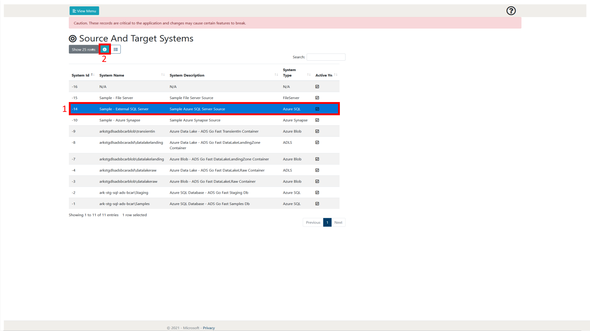 
Figure 8.2.3-1: SourceAndTargetSystems view details for System (-14)  

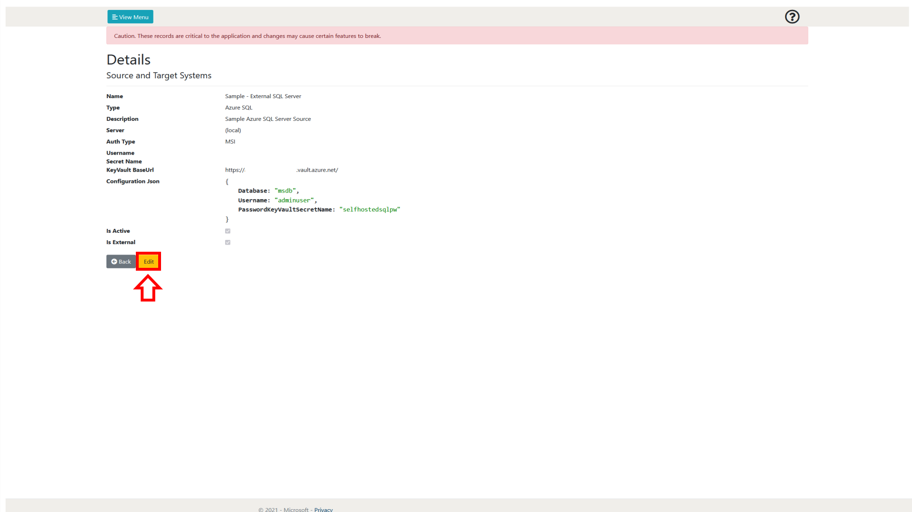 
Figure 8.2.3-2: SourceAndTargetSystems System -14 details  

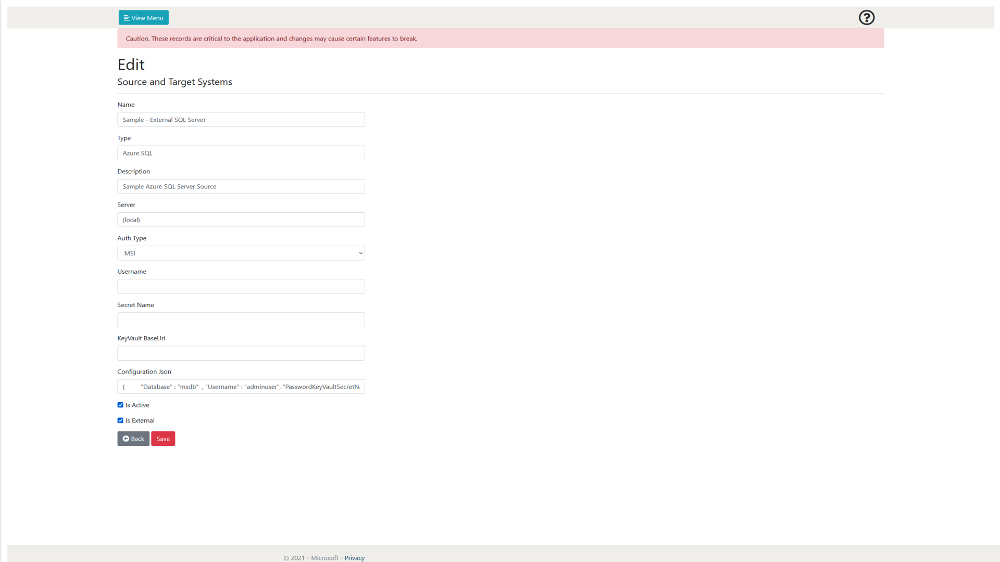 
Figure 8.2.3-3: SourceAndTargetSystems System -14 edit page 

## 8.3 Current Roles Available

This section contains a list of current roles available to be used
within the Web Application.

**Reader -** Allows the user or group to view all pages within the Web
Application and inspect the details of each entity on those pages.

**Administrator -** Allows the user or group to view all pages within
the Web application and add, modify and delete all entities within the
Web Application.

Note: If a role is given to a user on the EntityRoleMap page, that role
is **ONLY** applicable in conjunction to the specific entity being
referenced.
